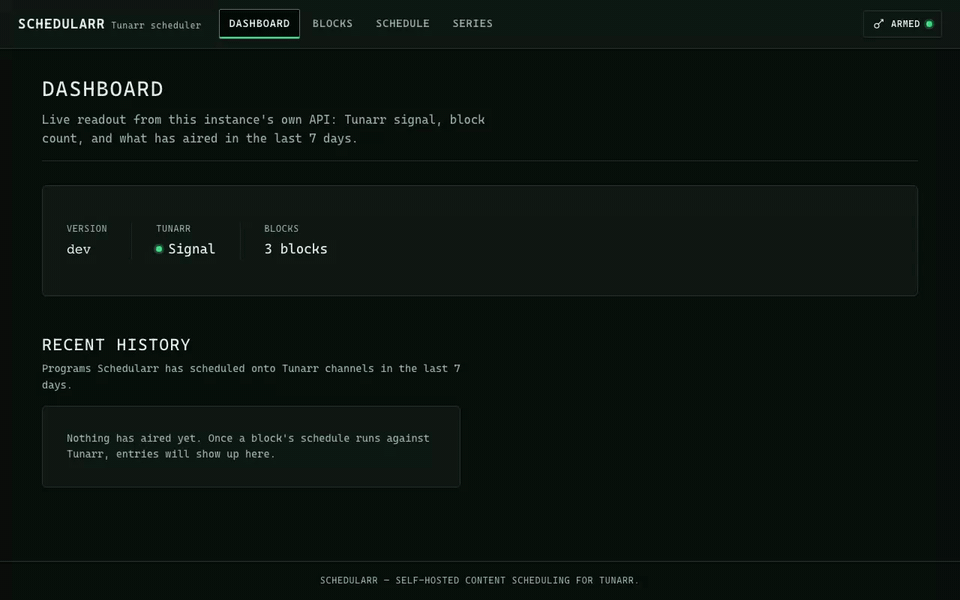

<div align="center">


# Schedularr

## Content Scheduling for Tunarr

[](https://github.com/christopherime/schedularr/actions/workflows/ci.yaml)
[](https://go.dev/)
[](LICENSE)
[](https://github.com/christopherime/schedularr/pulls)

**Cron-based content scheduling for [Tunarr](https://tunarr.com) TV channels, driven by rule-based blocks and content filters.**

[Docs](https://christopherime.github.io/schedularr/) • [Quickstart](#quickstart) • [Features](#features)



</div>

---

Schedularr generates and applies TV channel schedules for [Tunarr](https://tunarr.com). Scheduling rules ("blocks") define a time slot, a cron expression, a target channel, and a content filter; Schedularr resolves each block against Tunarr's library and pushes the result back to Tunarr. It runs as a one-shot CLI command or as a long-lived process (`serve`) exposing an HTTP API, a web UI, and a cron-driven schedule cycle.

## Features

- **Tunarr integration** — reads channels and library content from Tunarr, pushes schedules back
- **Content filtering** — regex title matching, genre/rating filters, year ranges, duration constraints
- **Series blocks** — sequential episode progression per show, with season/episode state persisted
- **Cron scheduling** — standard cron expressions, plus a Simple-mode picker in the web UI
- **HTTP API + web UI** — blocks CRUD, generate/apply, history, series state, channels, status
- **Dry run** — `generate` without `--apply` previews a schedule without pushing it to Tunarr

## Quickstart

```bash
docker run -d --name schedularr \
  -p 8484:8484 \
  -v "$(pwd)/config.yaml:/etc/schedularr/config.yaml:ro" \
  -v schedularr-data:/data \
  -e SCHEDULARR_API_TOKEN="$(openssl rand -hex 32)" \
  ghcr.io/christopherime/schedularr:latest
```

Open `http://<host>:8484/` and paste the `SCHEDULARR_API_TOKEN` value into the token panel. Full setup, building from source, and the config reference are on the [docs site](https://christopherime.github.io/schedularr/).

## Links

- **Documentation**: <https://christopherime.github.io/schedularr/>
- **Helm chart**: <https://github.com/geekxflood/helm-charts>
- **Releases**: <https://github.com/christopherime/schedularr/releases>
