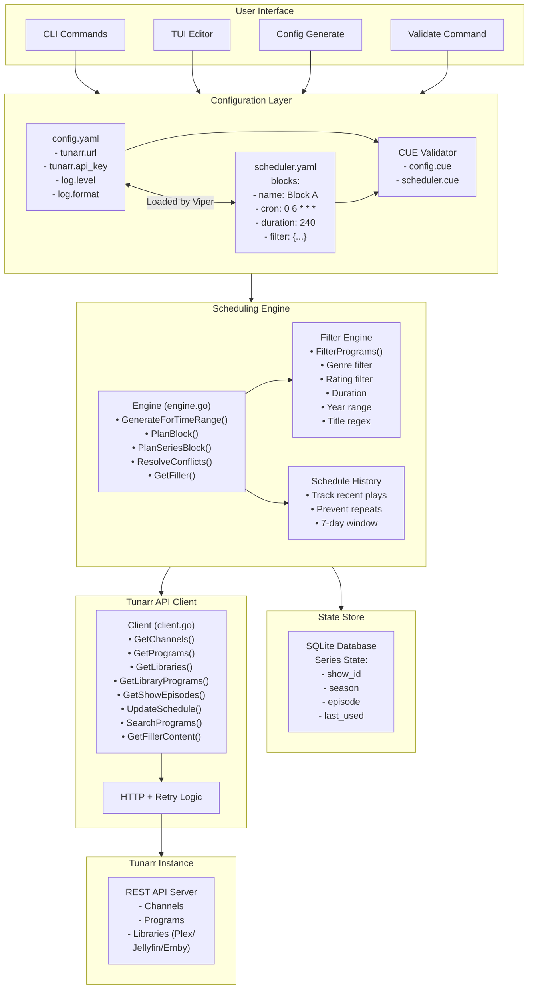

# Schedularr Architecture

This document describes Schedularr's system architecture, including component interactions, data flow, and design patterns adopted from the athena project.

## System Overview

Schedularr is an intelligent automation tool for Tunarr TV channel programming. It uses cron-based scheduling to automatically generate and apply content schedules based on user-defined rules (blocks). The system handles content filtering, series progression tracking, conflict resolution, and gap filling to create optimal channel lineups.

### Key Components

- **CLI Interface** (`cmd/`) - User commands for configuration, scheduling, and monitoring
- **Scheduling Engine** (`internal/scheduler/`) - Core logic for schedule generation and content selection
- **Tunarr Client** (`internal/tunarr/`) - API client for communication with Tunarr instances
- **State Store** (`internal/store/`) - SQLite-based persistence for series progression and history
- **Configuration** (`internal/config/`) - CUE schema-based configuration management
- **TUI** (`internal/tui/`) - Interactive terminal interface for block editing

## Architecture Diagram



## Component Details

### CLI Interface (`cmd/`)

The CLI provides commands for all user interactions:

- **`schedularr generate`** - Generate and optionally apply schedules
- **`schedularr run`** - Start daemon mode with cron-based execution
- **`schedularr channels`** - List available Tunarr channels
- **`schedularr tui`** - Launch interactive block editor
- **`schedularr validate`** - Validate configuration files
- **`schedularr config generate`** - Generate config templates
- **`schedularr scheduler init`** - Create scheduler configuration

### Scheduling Engine (`internal/scheduler/`)

Core scheduling logic with multiple responsibilities:

#### Engine (`engine.go`)

- **GenerateForTimeRange(start, end, programs)** - Main entry point that:
  1. Parses cron expressions for each block
  2. Identifies scheduling windows within time range
  3. Plans content for each window
  4. Resolves conflicts between overlapping blocks
  5. Returns map of channel_id → []Program

- **PlanBlock(block, startTime, programs)** - Handles single block:
  1. Applies filter criteria to available programs
  2. Removes recently played content (history check)
  3. Randomly shuffles candidates
  4. Fills block duration using greedy selection
  5. Optionally adds filler content for gaps
  6. Records scheduled programs in history

- **PlanSeriesBlock(block, programs)** - Series progression:
  1. Loads current episode state from SQLite
  2. Fetches next N episodes from Tunarr
  3. Updates episode state (season/episode increment)
  4. Handles series completion (restart or fallback)
  5. Stores pending state for commit

#### Filter Engine (`filter.go`)

Applies multiple filter criteria using AND logic:

- **Genre Filtering** - Match any genre in list
- **Rating Filtering** - Match specific content ratings
- **Year Range** - Filter by release year (min/max)
- **Duration Range** - Filter by program length
- **Title Regex** - Pattern matching on titles
- **Tag Filtering** - Match custom tags

#### Schedule History (`history.go`)

Tracks recently scheduled content per channel:

- **Window**: Configurable time period (default 7 days)
- **Purpose**: Prevent content repetition
- **Storage**: In-memory map with cleanup
- **Key**: `channel_id:program_id`

### Tunarr Client (`internal/tunarr/`)

HTTP client with robust error handling:

#### Features

- **Exponential Backoff Retry** - Retries on 429, 503, 5xx errors
- **Context Support** - All methods accept `context.Context`
- **Request Validation** - Validates inputs and responses
- **Error Wrapping** - Descriptive error context
- **Authentication** - Optional `X-API-Key` header

#### API Methods

- `GetChannels(ctx)` - List all channels
- `GetPrograms(ctx)` - List all programs (fallback)
- `GetLibraries(ctx)` - List media libraries (Plex/Jellyfin/Emby)
- `GetLibraryPrograms(ctx, libraryID)` - Get content from library
- `GetShows(ctx)` - List TV shows
- `GetShowEpisodes(ctx, showID, season)` - Get episodes for show
- `SearchPrograms(ctx, query)` - Search by title
- `GetFillerLists(ctx)` - List filler content collections
- `GetFillerContent(ctx, fillerListID)` - Get filler programs
- `UpdateSchedule(ctx, channelID, programs)` - Apply schedule to channel

### State Store (`internal/store/`)

SQLite-based persistence for series state:

#### Schema

```sql
CREATE TABLE series_state (
    block_id TEXT PRIMARY KEY,
    show_id TEXT NOT NULL,
    season INTEGER NOT NULL,
    episode INTEGER NOT NULL,
    last_updated INTEGER NOT NULL
);
```

#### Operations

- `LoadSeriesState(blockID)` - Retrieve current episode
- `SaveSeriesState(blockID, state)` - Persist updated state
- **Transaction Support** - Pending states for atomic commits
- **Rollback** - Discard uncommitted state changes

### Configuration (`internal/config/`)

CUE schema-based configuration with Viper loading:

#### Config Files

- **`config.yaml`** - Application settings
  - Tunarr connection (URL, API key)
  - Logging configuration (level, format)

- **`scheduler.yaml`** - Scheduling rules
  - Block definitions (cron, duration, filters)
  - Series configuration (show ID, progression rules)
  - Filler settings (list ID, max duration)

#### CUE Schemas

- **`cmd/schema/config.cue`** - App config validation
- **`cmd/schema/scheduler.cue`** - Scheduler validation

## Data Flow

### Schedule Generation Flow

```text
1. User runs: schedularr generate --apply

2. Load Configuration
   ├─► Load config.yaml (Tunarr URL, logging)
   ├─► Load scheduler.yaml (blocks, rules)
   └─► Validate both with CUE schemas

3. Initialize Components
   ├─► Create Tunarr client
   ├─► Create SQLite store
   ├─► Create scheduling engine
   └─► Create logger

4. Fetch Available Content
   ├─► GetLibraries() from Tunarr
   ├─► For each library:
   │   └─► GetLibraryPrograms(libraryID)
   └─► Result: []Program (all available content)

5. Generate Schedule
   ├─► For each block in scheduler.yaml:
   │   ├─► Parse cron expression
   │   ├─► Find next occurrence in time range
   │   └─► For each occurrence:
   │       ├─► If series block:
   │       │   ├─► Load series state from SQLite
   │       │   ├─► Fetch next episodes from Tunarr
   │       │   └─► Update episode counter
   │       ├─► If filter block:
   │       │   ├─► Apply genre/rating/year/duration filters
   │       │   ├─► Check schedule history (no recent repeats)
   │       │   ├─► Shuffle remaining candidates
   │       │   └─► Fill block duration (greedy selection)
   │       └─► If gap remaining:
   │           └─► GetFillerContent() and fill
   │
   ├─► Collect all scheduled slots
   ├─► Resolve conflicts (priority-based)
   └─► Group by channel_id

6. Apply to Tunarr (if --apply)
   ├─► For each channel_id:
   │   └─► UpdateSchedule(channel_id, programs[])
   ├─► Commit series state to SQLite
   └─► Display success/failure summary

7. Result
   └─► Tunarr channels updated with new schedules
```

### Series Progression Flow

```text
1. PlanSeriesBlock called with:
   ├─► Block config (show_id, episodes_per_block)
   ├─► Start time
   └─► All available programs

2. Load Current State
   ├─► Query SQLite: SELECT * FROM series_state WHERE block_id = ?
   └─► Result: {show_id, season, episode, last_updated}

3. Fetch Next Episodes
   ├─► GetShowEpisodes(ctx, show_id, season)
   ├─► Filter: episode >= current_episode
   ├─► Take: episodes_per_block (e.g., 3 episodes)
   └─► Result: []Program (next 3 episodes)

4. Update State
   ├─► If got full block of episodes:
   │   └─► Increment episode counter
   ├─► If reached end of season:
   │   ├─► Increment season
   │   └─► Reset episode to 1
   ├─► If series complete:
   │   └─► Restart from S01E01 OR use fallback content
   └─► Store in pending_states (not committed yet)

5. Return Episodes
   └─► []Program with proper duration and metadata

6. Commit (after successful schedule apply)
   └─► SQLite: INSERT OR REPLACE INTO series_state VALUES (...)
```

### Conflict Resolution Flow

```text
1. Collect All Scheduled Slots
   ├─► Each slot has: {StartTime, EndTime, Block, Programs}
   └─► Multiple blocks may schedule same time

2. Detect Overlaps
   ├─► For each pair of slots:
   └─► If time ranges overlap:
       └─► Mark as conflict

3. Resolve by Priority
   ├─► Sort conflicting slots by Block.Priority (descending)
   ├─► Keep highest priority
   ├─► Log conflict resolution
   └─► Discard lower priority slots

4. Return Non-Overlapping Schedule
   └─► []ScheduledSlot with no time conflicts
```

## Athena Project Patterns

Schedularr adopts the following patterns from the athena project to improve code quality and maintainability.

## Key Patterns Adopted

### 1. CUE Schema Validation

**Pattern:** Use CUE language for configuration validation with type safety and default values.

**Implementation:**

- `configs/schema/config.cue` - Application configuration schema
- `configs/schema/scheduler.cue` - Scheduler configuration schema
- Integration with config loading to validate on startup
- Detailed error messages with line numbers and suggestions

**Benefits:**

- Type-safe configuration with compile-time validation
- Default values defined in schema
- Self-documenting configuration structure
- Prevents invalid configurations from starting the application

**Example from athena:**

```cue
#Config: {
    server: {
        port:          int | *9600
        read_timeout:  string | *"30s"
        write_timeout: string | *"30s"
    }
    logging: {
        level:  "debug" | "info" | "warn" | "error" | *"info"
        format: "json" | "text" | *"json"
    }
}
```

### 2. CLI Command Structure

**Pattern:** Standardized command structure with clear separation of concerns.

**Commands:**

- **Root (no verb):** `./schedularr` - Default behavior launches TUI
- **validate:** `./schedularr validate [file]` - Validate configuration files
- **generate:** `./schedularr generate [options]` - Generate configuration templates
- **run:** `./schedularr run [options]` - Start the scheduling daemon

**Benefits:**

- Intuitive command structure
- Clear separation between validation, generation, and execution
- Consistent with other CLI tools in the ecosystem

### 3. Code Quality Standards

**Pattern:** Strict linting rules and coding standards enforced via golangci-lint.

**Standards:**

- Cyclomatic complexity: max 15
- Cognitive complexity: max 20
- Nesting depth: max 5
- Function results: max 3
- Arguments: max 5

**Blocked Packages:**

- `github.com/pkg/errors` (use stdlib `fmt.Errorf`)
- `logrus` (use `log/slog`)
- `crypto/md5`, `crypto/sha1` (security)
- `io/ioutil` (deprecated)
- `gopkg.in/yaml.v1`, `gopkg.in/yaml.v2` (use v3)

**Benefits:**

- Consistent code style across projects
- Reduced cognitive load when reading code
- Prevention of common security issues
- Use of modern Go idioms

### 4. Structured Logging

**Pattern:** Use `log/slog` for structured logging with JSON output.

**Implementation:**

- JSON format for production
- Text format for development
- Context fields (channel_id, block_name, etc.)
- snake_case for log field names

**Benefits:**

- Machine-parseable logs
- Easy integration with log aggregation systems
- Consistent log format across services
- Better debugging with structured context

### 5. Error Handling

**Pattern:** Always wrap errors with context using `fmt.Errorf`.

**Implementation:**

```go
if err != nil {
    return fmt.Errorf("failed to query tunarr: %w", err)
}
```

**Benefits:**

- Clear error context throughout the call stack
- Easy to trace error origins
- Supports error unwrapping with `errors.Is` and `errors.As`

### 6. Documentation Structure

**Pattern:** Comprehensive documentation following a standard structure.

**Documents:**

- `docs/ARCHITECTURE.md` - System architecture and data flow
- `docs/SPECIFICATIONS.md` - Detailed specifications and formats
- `CLAUDE.md` - AI assistant guidance and development commands
- `ROADMAP.md` - Project vision and development phases
- `CONTRIBUTING.md` - Contribution guidelines and PR process

**Benefits:**

- Easy onboarding for new contributors
- Clear project vision and roadmap
- Consistent documentation across projects
- AI-friendly development guidance

### 7. Build Tooling

**Pattern:** Makefile-based build system with standard targets.

**Targets:**

- `make build` - Build binary to `./bin/schedularr`
- `make test` - Run tests with race detector
- `make lint` - Run golangci-lint
- `make clean` - Remove build artifacts
- `make validate` - Validate all config files
- `make e2e-up` - Start E2E test environment
- `make e2e-down` - Stop E2E test environment

**Benefits:**

- Consistent build commands across projects
- Easy CI/CD integration
- Simplified local development workflow

### 8. Testing Infrastructure

**Pattern:** Comprehensive testing with unit, integration, and E2E tests.

**Implementation:**

- Table-driven tests for core functions
- Integration tests with mocked dependencies
- E2E tests with docker-compose
- Test fixtures and sample data
- >80% code coverage target

**Benefits:**

- High confidence in code changes
- Easy to add new test cases
- Reproducible test environments
- Catches regressions early

## Migration Path

The migration to these patterns is organized in Phase 0 of the TODO.md file. The recommended order is:

1. **CUE Schema Integration** - Establish configuration validation
2. **CLI Command Restructuring** - Align command structure
3. **Code Quality Alignment** - Update linting and logging
4. **Documentation** - Create comprehensive docs
5. **Build Tooling** - Standardize build process

## References

- Athena project: `/Users/christophe/athena`
- CUE language: <https://cuelang.org/>
- golangci-lint: <https://golangci-lint.run/>
- Conventional Commits: <https://www.conventionalcommits.org/>
