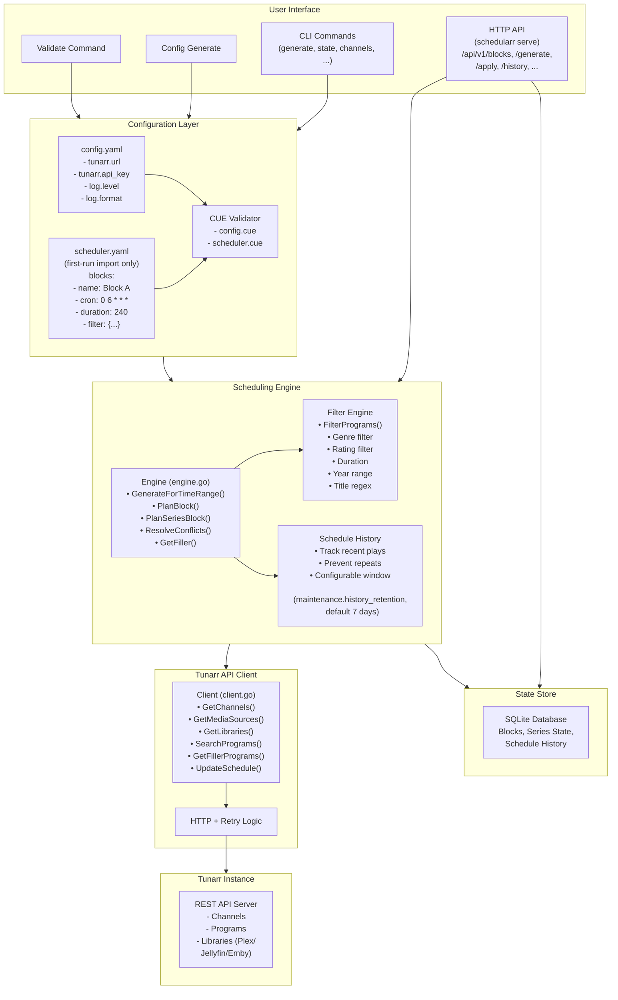

# Architecture

Schedularr automates Tunarr TV channel programming: cron-based scheduling generates and applies content schedules from user-defined blocks, handling content filtering, series progression tracking, conflict resolution, and gap filling.

## Key components

- **CLI Interface** (`cmd/`) — user commands for configuration, scheduling, and monitoring.
- **Scheduling Engine** (`internal/scheduler/`) — core logic for schedule generation and content selection.
- **HTTP API** (`internal/api/`) — blocks CRUD, schedule generate/apply, history, series state, channels, and status, hosted by `schedularr serve` alongside the cron scheduling loop and the embedded web UI.
- **Tunarr Client** (`internal/external/tunarr/`) — API client for communication with Tunarr instances.
- **State Store** (`internal/store/`) — SQLite-based persistence for blocks, series progression, and schedule history.
- **Configuration** (`internal/config/`, `internal/cueconfig/`) — CUE schema-based configuration management.

There is no interactive terminal UI: a former Bubble Tea TUI (block-editing forms, launched by a bare `schedularr` invocation) was removed. Blocks are managed through the `/api/v1/blocks` HTTP API, the [Web UI](web-ui-guide.md), or `scheduler.yaml` first-run import (see [Scheduling Concepts](scheduling-concepts.md)).

## Diagram



## Project structure

```txt
schedularr/
├── main.go                    # Entry point
├── api/
│   └── openapi.yaml           # OpenAPI 3.0.3 contract (source of truth for internal/api/gen)
├── cmd/                        # CLI commands (Cobra)
│   ├── channels.go             # List Tunarr channels
│   ├── generate.go             # Generate & apply schedules
│   ├── serve.go                # HTTP API server + cron scheduling loop
│   ├── validate.go             # Config validation
│   ├── state.go                # Series state management
│   ├── config.go               # App config generation/dump
│   ├── health.go               # Standalone healthz/livez probe server
│   ├── scheduler.go            # scheduler.yaml import-file authoring
│   └── schema/                 # CUE schemas for validation
│       ├── config.cue
│       └── scheduler.cue
├── internal/
│   ├── config/                 # CUE-based config loading (see internal/cueconfig)
│   ├── cueconfig/               # CUE schema compilation, validation, generation
│   ├── scheduler/                # Core scheduling engine
│   │   ├── engine.go             # GenerateForTimeRange, PlanBlock, PlanSeriesBlock
│   │   ├── filter.go             # Genre/rating/year/duration/title filters
│   │   ├── history.go            # Schedule history (prevent repeats)
│   │   └── types.go
│   ├── external/tunarr/          # Tunarr REST API client
│   ├── store/                    # SQLite persistence (blocks, series state, history)
│   │   └── migrations/
│   ├── api/                      # HTTP API: router, handlers, generated gen.ServerInterface
│   │   └── gen/                  # server.gen.go -- generated, do not hand-edit
│   ├── service/                   # Schedule generate/apply workflow (shared by CLI + API)
│   ├── blockio/                   # scheduler.yaml parse/render + first-run store import
│   ├── problem/                   # RFC 7807 application/problem+json helpers
│   ├── metrics/                   # Prometheus metrics registration
│   ├── cache/                     # In-memory caching
│   └── httpclient/                # HTTP client with retry
├── configs/
│   └── config.yaml              # Example configuration
├── e2e/                          # Docker-based acceptance tests against a real Tunarr
├── web/                           # Hugo web UI, embedded via go:embed (see Web UI Guide)
│   ├── DESIGN.md                    # Shipped design system: tokens, components, WCAG evidence, Alpine rules
│   ├── hugo.toml                    # Site config (baseURL, disabled kinds)
│   ├── package.json                  # devDeps: typescript, openapi-typescript
│   ├── tsconfig.json                  # Strict TS config for web/assets/ts
│   ├── embed.go                       # package web -- //go:embed all:public, web.Site()
│   ├── layouts/                       # Hugo templates
│   ├── content/                       # Hugo section front matter
│   ├── assets/                        # css/, ts/, vendor/ (Alpine.js, cronstrue)
│   └── public/                        # Hugo build output (gitignored)
└── docs/                          # This site's source
```

## Key technologies

- **Language**: Go 1.27
- **CLI framework**: [Cobra](https://github.com/spf13/cobra)
- **Configuration**: [CUE](https://cuelang.org/) schemas (`cmd/schema/`, `internal/cueconfig`), not Viper
- **HTTP API**: [chi](https://github.com/go-chi/chi) router, generated from `api/openapi.yaml` via [oapi-codegen](https://github.com/oapi-codegen/oapi-codegen)
- **Persistence**: SQLite (`mattn/go-sqlite3`), migrated with [golang-migrate](https://github.com/golang-migrate/migrate)
- **Cron parsing**: [robfig/cron](https://github.com/robfig/cron)

## Component details

### CLI interface (`cmd/`)

- `schedularr generate` — generate and optionally apply schedules
- `schedularr serve` — run the HTTP API server + cron scheduling loop + web UI
- `schedularr channels` — list available Tunarr channels
- `schedularr validate` — validate configuration files
- `schedularr config generate` — generate config templates
- `schedularr scheduler init` — create scheduler configuration
- `schedularr state` — export/import/reset/set/list/backup series progression state

See the [CLI Reference](cli-reference.md) for the full command and flag list.

### Scheduling engine (`internal/scheduler/`)

**Engine (`engine.go`)**

- `GenerateForTimeRange(start, end, programs)` — parses cron expressions per block, identifies scheduling windows in the time range, plans content for each window, resolves conflicts, returns `channel_id → []Program`.
- `PlanBlock(block, startTime, programs)` — applies filter criteria, removes recently played content, shuffles candidates, greedily fills the block duration, optionally adds filler, records scheduled programs in history.
- `PlanSeriesBlock(block, programs)` — loads current episode state from SQLite, fetches the next N episodes from Tunarr, updates episode state, handles series completion, stores pending state for commit.

**Filter engine (`filter.go`)** — genre, rating, year range, duration range, title regex, tag filters. See [Scheduling Concepts](scheduling-concepts.md#filter-based-blocks) for the field reference.

**Schedule history (`history.go`)** — tracks recently scheduled content per channel to prevent repetition; in-memory map keyed `channel_id:program_id`, cleared on restart, plus the persisted `schedule_history` table (which also carries each occurrence's own `block_name`/`occurrence_start`-keyed assignment, and a `series_occurrence_snapshots` table — keyed by the block's stable store ID rather than its renameable name, and pruned on the same retention window as `schedule_history` (by write time, not the occurrence's own start) — carrying each series occurrence's starting cursor — together the persistence behind idempotent apply, see [Scheduling Concepts](scheduling-concepts.md#idempotent-apply-and-editing-a-block-before-it-airs)). See [Scheduling Concepts](scheduling-concepts.md#schedule-history-and-retention) for the retention/dedup half.

### Tunarr client (`internal/external/tunarr/`)

Exponential backoff retry (429, 503, 5xx), `context.Context` on every method, request/response validation, descriptive error wrapping, optional `X-API-Key` header.

`GetChannels`, `GetMediaSources`, `GetLibraries(mediaSourceID)`, `SearchPrograms(request)`, `GetFillerPrograms(fillerListID)`, `UpdateSchedule(channelID, programs)`.

### State store (`internal/store/`)

SQLite persistence for series state, blocks, and schedule history:

```sql
CREATE TABLE series_state (
    show_title TEXT PRIMARY KEY,
    current_season INTEGER NOT NULL,
    current_episode INTEGER NOT NULL,
    last_aired DATETIME,
    completed BOOLEAN NOT NULL DEFAULT FALSE,
    run_count INTEGER NOT NULL DEFAULT 0,
    disabled BOOLEAN NOT NULL DEFAULT FALSE
);
```

Series state changes are pending in memory until the schedule applies successfully to Tunarr — commit on success, rollback (discard) on failure or on exit without committing.

### Configuration (`internal/config/`)

CUE schema-based configuration, for both validation and default values (`internal/cueconfig`) — no Viper dependency. Two files: `config.yaml` (application settings: Tunarr connection, logging, database path, `api.*`, `cron_interval`) and `scheduler.yaml` (a first-run block-import file only — see [Scheduling Concepts](scheduling-concepts.md)). Schemas live in `cmd/schema/config.cue` and `cmd/schema/scheduler.cue`.

```bash
# Validate against the CUE schema directly (advanced; `schedularr validate` wraps this)
cue vet config.yaml cmd/schema/config.cue
```

A validation failure reports the field path and the constraint that failed, e.g.:

```text
Error: blocks[0].cron: invalid cron expression "60 25 * * *"
  minute must be 0-59
  hour must be 0-23

Error: blocks[0]: missing required field "channel_id"

Error: blocks[0].filter.max_duration: value 30 less than min_duration 90
```

## Data flow

### Schedule generation

```text
1. User runs: schedularr generate --apply

2. Load Configuration
   ├─► Load config.yaml (Tunarr URL, logging)
   ├─► Load scheduler.yaml (blocks, rules) -- first run only
   └─► Validate both with CUE schemas

3. Initialize Components
   ├─► Create Tunarr client
   ├─► Create SQLite store
   ├─► Create scheduling engine
   └─► Create logger

4. Fetch Available Content
   ├─► GetMediaSources() from Tunarr
   ├─► GetLibraries(mediaSourceID) for each source
   ├─► SearchPrograms() with library filters
   └─► Result: []Program (all available content)

5. Generate Schedule
   ├─► For each block:
   │   ├─► Parse cron expression, find next occurrence in time range
   │   └─► For each occurrence:
   │       ├─► Series block: load state, fetch next episodes, update counter
   │       ├─► Filter block: apply filters, check history, shuffle, greedy-fill
   │       └─► Gap remaining: GetFillerContent() and fill
   ├─► Collect all scheduled slots
   ├─► Resolve conflicts (priority-based)
   └─► Group by channel_id

6. Apply to Tunarr (if --apply)
   ├─► UpdateSchedule(channel_id, programs[]) per channel
   ├─► Commit series state to SQLite
   └─► Display success/failure summary
```

### Conflict resolution

```text
1. Collect all scheduled slots -- {StartTime, EndTime, Block, Programs}
2. Detect overlaps between slot pairs
3. Sort conflicting slots by Block.Priority (descending); keep highest, discard the rest; log each resolution
4. Return the non-overlapping schedule
```

See [Scheduling Concepts](scheduling-concepts.md#priority-and-conflict-resolution) for priority-range conventions.

## Patterns

Schedularr adopted these patterns from an internal reference project (`athena`) for code quality and maintainability:

1. **CUE schema validation** — type-safe configuration with compile-time validation, default values defined in-schema, self-documenting structure, detailed error messages with line numbers.
2. **CLI command structure** — root command prints usage with no default action; `validate`, `generate`, `serve` each own one concern.
3. **Code quality standards** — cyclomatic complexity ≤ 15, cognitive complexity ≤ 20, nesting depth ≤ 5, ≤ 3 function results, ≤ 5 arguments, enforced via golangci-lint. Blocked packages: `github.com/pkg/errors` (use `fmt.Errorf`), `logrus` (use `log/slog`), `crypto/md5`/`crypto/sha1`, `io/ioutil`, `gopkg.in/yaml.v1`/`v2` (use `v3`).
4. **Structured logging** — `log/slog`, JSON in production, text in development, snake_case field names.
5. **Error handling** — always wrap with context: `fmt.Errorf("failed to query tunarr: %w", err)`.
6. **Documentation structure** — this site, plus `CLAUDE.md`/`AGENTS.md`/`GEMINI.md` (AI assistant guidance) and `TODO.md` (refactoring notes and the deferred-work backlog), kept current in the same commit as the code they describe.
7. **Build tooling** — a Makefile with standard targets (`build`, `test`, `lint`, `clean`, `validate`, `e2e-up`/`e2e-down`).
8. **Testing infrastructure** — table-driven unit tests, integration tests with mocked dependencies, Docker-based E2E tests, fixtures in `testdata/`.

## References

- [CUE language](https://cuelang.org/)
- [golangci-lint](https://golangci-lint.run/)
- [Conventional Commits](https://www.conventionalcommits.org/)
