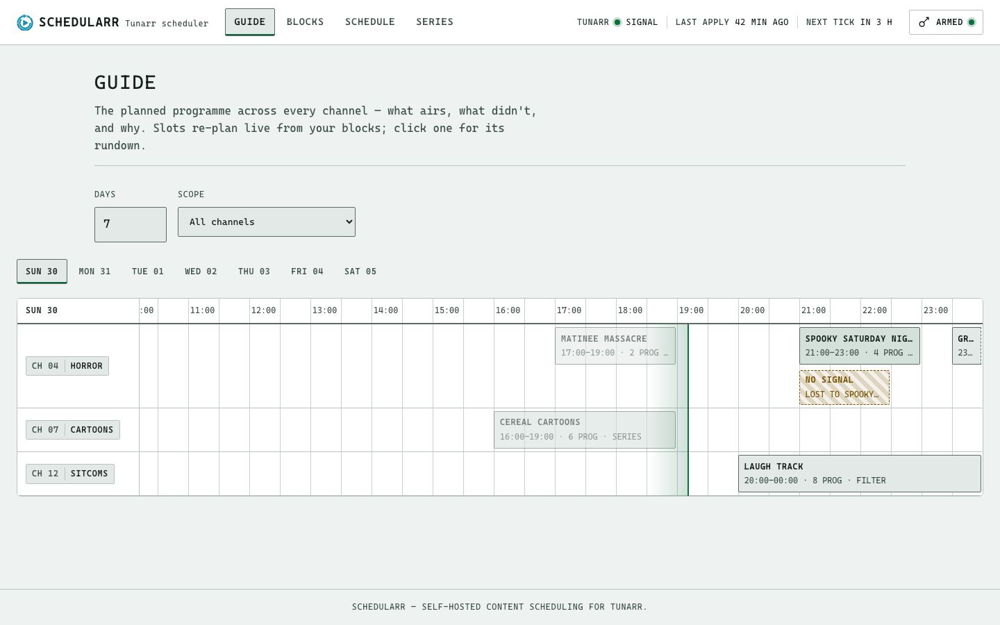

# Web UI Guide

A Hugo-built web UI lives in `web/` and is embedded into the `schedularr` binary via `go:embed` (`web/embed.go`, `package web`, `web.Site()`). `schedularr serve` mounts it as `internal/api.Config.UI` and serves it from the router's catch-all `NotFound` handler: the four system routes (`/healthz`, `/readyz`, `/metrics`, `/openapi.json`) and `/api/v1/*` win first, and everything else falls through to the embedded site.

A directory request resolves to that directory's `index.html` (`/` → `index.html`, `/blocks/` → `blocks/index.html`); the same request without its trailing slash (`/blocks`) gets a 301 redirect to the slash form, like `net/http.FileServer`. A path that matches no file serves `404.html` with HTTP 404. Non-GET/HEAD requests get a 405.

Every response the UI handler serves carries `X-Content-Type-Options: nosniff`, `Referrer-Policy: same-origin`, and a Content-Security-Policy where every directive is `'self'`/`'none'` (the site vendors Alpine.js, no CDN, and only calls its own origin's `/api/v1`). See [Design System](design-system.md) for the full CSP rationale and the design tokens behind the UI.

## Building the UI

Nothing under `web/public/` is tracked in git; `make web-presence` (a prerequisite of `make build`) writes a one-line placeholder there on demand when it's missing, so `go build ./...` keeps working without Hugo installed. A release build (the Docker image) always runs the real `hugo --minify -s web` first and never ships the placeholder.

Prerequisites to build the real UI locally:

- **[Hugo](https://gohugo.io/installation/)** ≥ 0.120 — `brew install hugo`
- **[Node.js](https://nodejs.org/)** with npm — only used to generate and type-check TypeScript; not required to build the Go binary

```bash
# One-time: install the npm devDependencies (typescript, openapi-typescript)
npm install --prefix web

# Regenerate TS types from api/openapi.yaml, type-check, then build with Hugo
make web
```

`make web-types` (openapi-typescript → `web/assets/ts/gen/types.d.ts`), `make web-check` (type-check with `tsc --noEmit`), and `make web-build` (the Hugo build) are real prerequisites of each other, in that order, so `make -j` can't interleave them.

`make web-build` runs `hugo --minify --cleanDestinationDir -s web`. The clean flag is load-bearing: Hugo never deletes stale output on its own, so without it a previous dev build's `/kit/` page and unminified per-page bundles would linger in `web/public/` — and ride into locally built binaries via `go:embed all:public`. With it, `make web` always leaves exactly the production site in `web/public/`.

Hugo's config lives in `web/config/` (`_default/hugo.toml` plus a `production/hugo.toml` overlay). `make web` builds the production environment; `hugo -s web -e development` additionally builds the dev-only **`/kit/`** component gallery — every shared partial in every state, on fixture data — which is the review gate for UI changes and never ships in the binary.

### Shared runtime

Each page loads exactly one script bundle: a thin page entry (`web/assets/ts/pages/*.ts`) compiled together with the shared runtime (`web/assets/ts/runtime/`) — the typed API client (with request timeouts and a double-submit guard on every mutation), token storage, error/formatting helpers, the `/channels` cache behind the channel pickers and legend plates, the event tape, and the shell wiring (token panel + bezel telemetry).

### Unit tests

`make web-test` (also part of `make lint`, and a CI step) runs the UI logic tests in `web/tests/` on Node's built-in test runner — no test framework dependency; Node's native type stripping executes the `.test.ts` files directly. Page modules import cleanly under Node with small `document`/`window` stubs (their top-level side effects — registering an `alpine:init` listener and the shell init — are inert against them), and the vendored `cronstrue` UMD bundle is loaded as the same global the browser gets. The suite covers the runtime's error describing, typed path building, channel labeling/plates/ordering, formatting and the plan-days clamp, the guide grid's pure geometry (time→quantum clamping with overnight spills, grid-column mapping, day windowing, ghost placement, keyboard-nav picking), and the blocks page's cron round-trip and spec round-trip. Add new tests as `web/tests/*.test.ts`; they are type-checked by `tsc --noEmit` along with the sources.

## Token Setup

The UI talks to `/api/v1` with the same bearer token `schedularr serve` was started with (`SCHEDULARR_API_TOKEN` or `api.token` — see the [Deployment config reference](deployment.md#configuration-reference)). The token lives only in the browser's `localStorage` (key `schedularr_api_token`) and is attached to every API request; it is never embedded in the served HTML/JS.

1. Open the UI (`http://<host>:8484/` by default). With no token stored, the **Arm API Token** panel opens automatically.
2. Paste the same token the server was started with. The input is masked; click the eye icon to reveal it before saving.
3. **Save** stores the token, probes `GET /api/v1/status` with it, and flips the header dot to **Armed** only when that probe succeeds — the dot now means *verified*, not merely *stored*. A failed probe keeps the panel open with the error inline. **Clear** wipes the token (and leaves the panel open).
4. If any API call comes back `401` (wrong or expired token), the dot drops to **Unarmed** and the panel opens automatically with an inline error — but at most **once per unarmed episode**: dismiss it, and later 401s (including the 60-second telemetry poll's) only keep the dot and inline error current instead of re-stealing focus every minute. Successfully arming a token starts a fresh episode. Arming also re-fires whichever page *loads* had failed — no per-section Retry grind — but never repeats a write (create/apply/delete); repeat those yourself.

## Bezel telemetry

The header carries a persistent telemetry strip on every page, refreshed from `GET /api/v1/status` every 60 seconds:

- **TUNARR** — signal dot plus text (**Signal** / **No Signal**, or **No data** while the poll itself can't reach the server).
- **LAST APPLY** — how long ago the most recent apply pushed a lineup to Tunarr (`Status.last_applied_at`), or an em dash before any apply has been recorded.
- **NEXT TICK** — when `serve`'s cron loop will next generate and apply (`Status.next_cron_tick`), or **due** while an overrunning tick is still mid-run (the loop records the next tick's time before running the current one, so the stored instant can already be in the past).

There is deliberately no LIVE/POLL link legend yet — that arrives with the SSE live layer (v0.5.4), and the strip does not pretend to be live before then.

## Event tape

Successful writes print onto an inline **event tape** under the page heading — timestamped uppercase lines, newest first, at most three retained, never a toast and never auto-dismissed. Saving, deleting, or toggling a block and toggling a series row all print tape lines.

## Page Tour

### The Guide (`/`)



*The programme guide as home: channels as tracks, one graticule division = 30 minutes, the sweep cursor at now, and a hatched NO SIGNAL ghost where a dropped occurrence would have aired.*

The home page is a full EPG grid of the **current plan**, loaded automatically from `GET /api/v1/schedule` the moment the page opens — no Generate click. Channels are rows headed by their legend plates; time runs horizontally on a ruler whose 30-minute cells are the literal graticule divisions, so slot boundaries land exactly on grid lines. The grid scrolls on its own axes (the page body never scrolls sideways) and opens scrolled to the **sweep cursor** — the accent now-line with its phosphor trail, advancing once per minute. Past slots dim behind it; the on-air slot carries the armed glow.

- **Toolbar** — **DAYS** (1–30, default 7) and **SCOPE** (a channel picker, default all channels). In this read-only slice, changing either re-fetches the plan; the draft/apply mode arrives on the Guide in v0.5.2, and until then the [Schedule page](#schedule-schedule) still owns preview/apply.
- **Day tabs** (`SUN 30 … SAT 05`) — navigate within the already-loaded window; tabs never re-plan. A slot that crosses midnight is cut at the day edge with a dashed edge and continues on the neighboring day.
- **Slots** — block name, time range, program count, and type on the face. Click (or Enter) opens the **inspector**: a right rail on desktop that compresses the grid (a bottom sheet on mobile) with the block name linking to its editor (`/blocks/?edit=<id>`), the channel plate, the time range with duration, the full **program rundown** (per-program start times and `SxxEyy` markers from the typed schedule shape), the cron with its plain-language readback, priority, and enabled state. Esc or the X closes it and returns focus to the slot.
- **NO SIGNAL ghosts** — every conflict warning in the current plan renders as an amber-hatched ghost slot at exactly the time it would have aired, labeled `NO SIGNAL — LOST TO <block>`, in a thin lane under the slot that displaced it. Its inspector states the verdict and links both blocks.
- **Keyboard** — slots form a roving tab stop: Left/Right walk a channel's track, Up/Down jump across channels to the nearest slot by start time, Enter opens the inspector, Esc closes it.
- **States** — loading is a grid-shaped skeleton aligned to the divisions. A failed plan (Tunarr unreachable) is an honest scanline **NO SIGNAL** blackout with a Retry — the guide re-plans live and never shows a cached lineup. An empty plan teaches: with no blocks at all it points at Blocks; with blocks that simply don't air in the window it says so.
- **Mobile** — under 640px the grid reflows into a vertical rundown: `TONIGHT` / `TOMORROW` / dated headings, one chronological slot list for the channel chosen in the picker, and the now-line as a horizontal rule between what aired and what's next. The inspector becomes a bottom sheet.

### Dashboard (`/dashboard/`, temporary)

The old dashboard left the navigation in v0.5.1: its status readouts live in the bezel telemetry strip on every page, and the Guide took home. The route survives **unlinked** at `/dashboard/` only for its Recent History table — reads `GET /api/v1/history?days=7` with channel legend plates — and is deleted outright when the Log page absorbs history in v0.5.3. Don't bookmark it.

### Blocks (`/blocks/`)


*The inline editor, open on a `series`-type block with two show rows.*

List every stored block and create/edit/delete them, backed entirely by `GET`/`POST`/`PUT`/`DELETE /api/v1/blocks[/{id}]`. One page, no routing between list and editor: a **+ New Block** button and each row's **Edit** open an inline panel above the list, which auto-scrolls into view and focuses the name field when it opens.

**List** — name, a type badge (`filter`/`series`), the raw cron plus a plain-language readback underneath it (**cronstrue** — see [Design System](design-system.md#vendored-dependencies)), the channel as a legend plate, an **Enabled/Disabled** toggle, and **Edit**/**Delete**. Delete opens the shared native `<dialog>` confirmation naming the block before anything is sent — the same confirm idiom the Schedule page's Apply uses. Load and action failures share one inline problem panel above the list, with **Reload blocks** as the recovery.

**Editor — common fields**: name, schedule (see "Schedule picker" below), duration (minutes), channel, priority, max duration overflow (minutes), and enabled. Name, schedule, duration, and channel are marked required with a static `*` next to the label. `channel_id` is a `<select>` populated from `GET /api/v1/channels` when Tunarr answers with at least one channel; while the list is still loading it shows an explicit disabled "Loading channels…" select, and it falls back to a free-text input (with an inline reason) when the call fails or returns nothing.

#### Schedule picker

A Simple/Cron mode toggle on the schedule field:

- **Simple mode** is a frequency select (daily / weekdays / weekly / monthly / custom days), day-of-week checkboxes (weekly/custom only), and a native `<input type="time">`, which together generate the 5-field cron string live as the operator adjusts them.
- **Cron mode** is the raw text field, with a permanent format caption (`min hour day-of-month month day-of-week (* = any)`) underneath it.

Switching from Cron to Simple mode parses the current cron string back into the picker's fields when the pattern is one Simple mode can represent (a plain fixed time, optionally restricted to specific weekdays or a single day-of-month); anything else — a day-of-month combined with a weekday restriction, a month restriction, a list/range/step on minute or hour — locks the field to Cron mode with an inline note rather than rendering a lossy guess.

A plain-language readback (**cronstrue**, vendored) renders live under the field in both modes, understanding any valid 5-field expression. Storage is unaffected either way: the cron string is still the one value submitted, whichever mode produced it.

#### Type-specific fields and autocomplete

`filter` shows genres/ratings/title-pattern(regex)/year range/duration range/tags (comma-separated inputs map to arrays; an empty input omits the field, it is never sent as `[]`). Genres and ratings are `<input list=...>` fields backed by a `<datalist>` populated from `GET /api/v1/media/meta`, fetched once per editor open; free text is always accepted regardless.

`series` shows repeating rows (show title, episodes per block, start season/episode, on-complete, skip-episodes, max runs — add/remove freely) plus a fallback section (redistribute/filler, with a nested filter subset when filler is chosen). Show title is the same `<input list=...>` pattern, backed by `GET /api/v1/media/shows`: an amber, non-blocking note ("Not found in Tunarr's library.") appears under a row whose typed title doesn't case-insensitively match any loaded show, as long as the media fetch itself succeeded — a failed fetch degrades silently to plain free text, with no datalist and no warning. Each row's array position is the airing order (see [Scheduling concepts](scheduling-concepts.md#idempotent-apply-and-editing-a-block-before-it-airs)); up/down buttons on each row reorder in place, disabled at the first row's up and the last row's down, and a note above the list states that a reorder applies from the next not-yet-aired occurrence.

A **Filler** section (enabled, filler list ID, max filler time, min gap time) is available for either type. Every section maps 1:1 onto `BlockSpec` — the submitted JSON only ever contains fields the operator actually filled in, plus `type` and `enabled` (always explicit).

**Validation** — `skip_episodes` is checked client-side against `SxxExx` (e.g. `S01E05`) before submit, with the exact invalid token(s) named inline; everything else is left to the API. A `400` renders its `title`/`detail` inline near the submit button; a `409` (duplicate name) renders under the **name** field specifically.

### Schedule (`/schedule/`)


*A generated preview: chronological slots per channel, each with an expandable program list.*

Preview a schedule, then apply it — a dry-run/apply pair backed by `POST /api/v1/generate` and `POST /api/v1/apply`, the same `GenerateRequest` body (`days`, optional `channel_id`) as the CLI's `generate`/`generate --apply`. A chronological list per channel; this page remains the apply surface until v0.5.2 folds preview/apply into the Guide as its draft mode (and then it is deleted).

**Controls** — a `days` number input (1–30, defaulting to 7, clamped client-side to that range before every request) and a `channel_id` scope: a `<select>` (first option always **All channels**) populated from `GET /api/v1/channels`, falling back to free text (blank still means all channels) when Tunarr is unreachable.

**Preview** — **Generate Preview** sends `POST /api/v1/generate`, which always dry-runs. Each channel in the response renders as its own section headed by its legend plate (`CH 04 · HORROR`, not the raw UUID): slots listed chronologically with **start**/**end** in the browser's local timezone, the block name, and a program count that expands (`<details>`) into the individual program titles. A visible **Preview — nothing applied** readout makes the dry-run state explicit. A blank days field previews the documented default of 7 days (previously it silently clamped to 1).

**Apply** — disabled until a preview has run **for the exact controls currently on screen**: editing `days` or the channel scope after a preview invalidates it immediately, and a fresh **Generate Preview** is required to re-arm it (the web equivalent of the CLI's `--yes` gate, applied per action rather than once per process). Clicking **Apply** opens a native `<dialog>` confirmation naming the scope exactly: **"Apply ALL channels"** or **"Apply channel `<id>`"**, plus a real slot/channel count summary. Confirming sends `POST /api/v1/apply` with the identical body the preview used — `/apply` independently re-runs the generate-and-push workflow server-side, so this means the same request, not a cached payload. A successful apply flips the readout to **Applied** with a summary line and immediately disables **Apply** again.

**Conflict warnings** — when two blocks' occurrences overlap on the same channel, the lower- (or, tied, later-listed) priority one loses and is left out of the schedule entirely (see [Priority and conflict resolution](scheduling-concepts.md#priority-and-conflict-resolution)). A preview or apply response carrying any dropped occurrences renders a warning panel above the channel list — one line per occurrence, naming the block, its would-be start time, and the block it lost to — instead of that information being visible only in the server log.

### Series (`/series/`)


*Tracked series with inline season/episode cursor editing, run count, and status toggles.*

Every persisted `series_state` row — the per-show season/episode cursor a series block advances as it airs — backed by `GET`/`PATCH /api/v1/state/series[/{show_title}]`. There is no create endpoint: a row exists only once a series block airs that show for the first time, so an empty result renders an explanatory empty state.

**List** — show title, an inline SxxEyy cursor editor, run count, last aired (local time, or an em dash for a show that hasn't aired yet), and a **Completed**/**In Progress** toggle plus a **Disabled**/**Active** toggle.

**Cursor editing** — season and episode are two adjacent number inputs (`min="1"`) framed by `S`/`E` prefixes, independently editable inline in the same cell. **Save** stays disabled until the row is actually dirty and, on click, sends a true partial `PATCH`: only `current_season` and/or `current_episode` land in the body, and only when their parsed value actually differs from what was loaded. A season/episode value that isn't a whole number `>= 1` is rejected client-side with an inline message. Each toggle is its own single-field `PATCH` (`{"completed": true}` or `{"disabled": true}` alone).

**Row vanishes mid-edit** — a save against a `show_title` whose `series_state` row was deleted or reset out from under the operator returns `404`. The row stays on screen with an inline error and a **Refresh list** action next to the show title, rather than a row that silently can never save again.

## See also

- [Scheduling Concepts](scheduling-concepts.md) for what a filter/series block actually configures.
- [API Reference](api-reference.md) for every endpoint the UI calls.
- [Design System](design-system.md) for the visual system and vendored dependencies.
