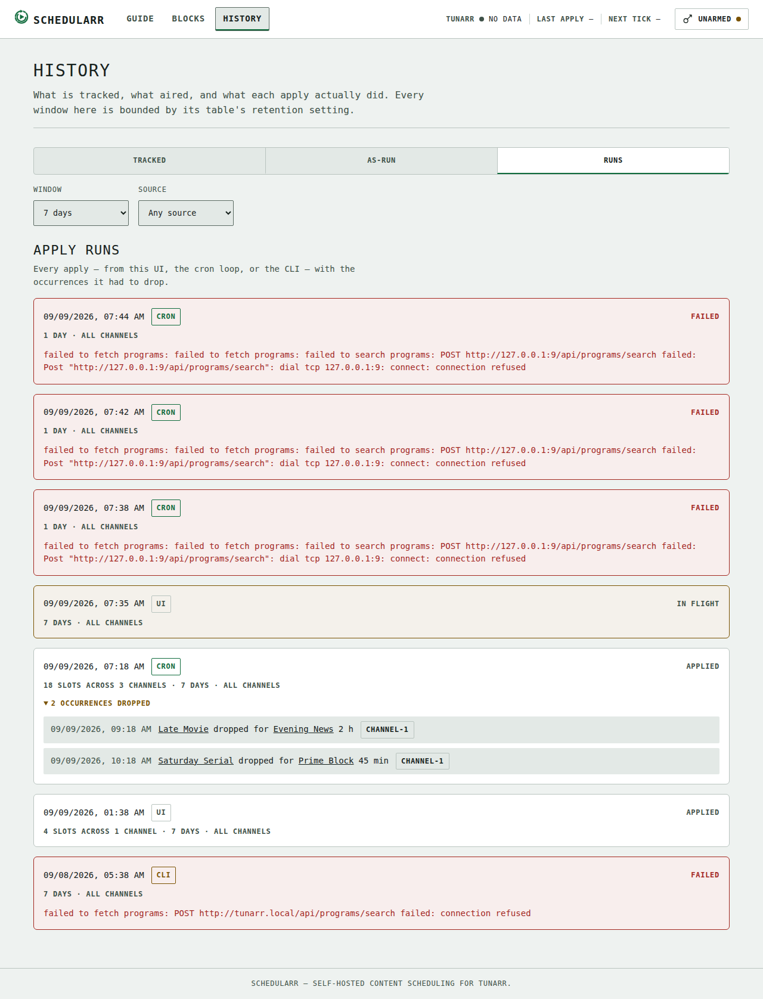

# Web UI Guide

A Hugo-built web UI lives in `web/` and is embedded into the `schedularr` binary via `go:embed` (`web/embed.go`, `package web`, `web.Site()`). `schedularr serve` mounts it as `internal/api.Config.UI` and serves it from the router's catch-all `NotFound` handler: the four system routes (`/healthz`, `/readyz`, `/metrics`, `/openapi.json`) and `/api/v1/*` win first, and everything else falls through to the embedded site.

A directory request resolves to that directory's `index.html` (`/` → `index.html`, `/blocks/` → `blocks/index.html`); the same request without its trailing slash (`/blocks`) gets a 301 redirect to the slash form, like `net/http.FileServer`. A path that matches no file serves `404.html` with HTTP 404. Non-GET/HEAD requests get a 405.

Every response the UI handler serves carries `X-Content-Type-Options: nosniff`, `Referrer-Policy: same-origin`, and a Content-Security-Policy where every directive is `'self'`/`'none'` (the site vendors Alpine.js, no CDN, and only calls its own origin's `/api/v1`). See [Design System](design-system.md) for the full CSP rationale and the design tokens behind the UI.

## Building the UI

Nothing under `web/public/` is tracked in git; `make web-presence` (a prerequisite of `make build`) writes a one-line placeholder there on demand when it's missing, so `go build ./...` keeps working without Hugo installed. A release build (the Docker image) always runs the real `hugo --minify -s web` first and never ships the placeholder.

Prerequisites to build the real UI locally:

- **[Hugo](https://gohugo.io/installation/)** ≥ 0.120 — `brew install hugo`
- **[Node.js](https://nodejs.org/)** with npm — only used to generate and type-check TypeScript; not required to build the Go binary

```bash
# One-time: install the npm devDependencies (typescript, openapi-typescript)
npm install --prefix web

# Regenerate TS types from api/openapi.yaml, type-check, then build with Hugo
make web
```

`make web-types` (openapi-typescript → `web/assets/ts/gen/types.d.ts`), `make web-check` (type-check with `tsc --noEmit`), and `make web-build` (the Hugo build) are real prerequisites of each other, in that order, so `make -j` can't interleave them.

`make web-build` runs `hugo --minify --cleanDestinationDir -s web`. The clean flag is load-bearing: Hugo never deletes stale output on its own, so without it a previous dev build's `/kit/` page and unminified per-page bundles would linger in `web/public/` — and ride into locally built binaries via `go:embed all:public`. With it, `make web` always leaves exactly the production site in `web/public/`.

Hugo's config lives in `web/config/` (`_default/hugo.toml` plus a `production/hugo.toml` overlay). `make web` builds the production environment; `hugo -s web -e development` additionally builds the dev-only **`/kit/`** component gallery — every shared partial in every state, on fixture data — which is the review gate for UI changes and never ships in the binary.

### Shared runtime

Each page loads exactly one script bundle: a thin page entry (`web/assets/ts/pages/*.ts`) compiled together with the shared runtime (`web/assets/ts/runtime/`) — the typed API client (with request timeouts and a double-submit guard on every mutation), token storage, error/formatting helpers, the `/channels` cache behind the channel pickers and legend plates, the event tape, and the shell wiring (token panel + bezel telemetry).

### Unit tests

`make web-test` (also part of `make lint`, and a CI step) runs the UI logic tests in `web/tests/` on Node's built-in test runner — no test framework dependency; Node's native type stripping executes the `.test.ts` files directly. Page modules import cleanly under Node with small `document`/`window` stubs (their top-level side effects — registering an `alpine:init` listener and the shell init — are inert against them), and the vendored `cronstrue` UMD bundle is loaded as the same global the browser gets. The suite covers the runtime's error describing, typed path building, channel labeling/plates/ordering, formatting, the guide grid's pure geometry (time→quantum clamping with overnight spills, grid-column mapping, window day counting and week chunking, join-vs-cut segment edges, primary-piece selection, pager range labels, ghost placement, keyboard-nav picking), the blocks page's cron round-trip and spec round-trip, its row readings (the NEXT cell's four states, the dark chip, the priority rank and where it is suppressed) and its power-tool predicates (the rail's state machine and occurrence labels, the series-row summaries, and what raises a mid-run cron confirm), the guide's draft model (the reading-vs-draft diff, the stored-reading codec, the request body, and every line of draft copy), and the draft state machine itself — the page registers its Alpine component on `alpine:init`, so the harness captures that factory and drives one fresh component per test against a stubbed fetch, observing the render queue, the fetch log, and where focus lands. Add new tests as `web/tests/*.test.ts`; they are type-checked by `tsc --noEmit` along with the sources.

## Token Setup

The UI talks to `/api/v1` with the same bearer token `schedularr serve` was started with (`SCHEDULARR_API_TOKEN` or `api.token` — see the [Deployment config reference](deployment.md#configuration-reference)). The token lives only in the browser and — since v0.5.5 — is **encrypted at rest**: an AES-GCM-256 key (non-extractable, held in IndexedDB) encrypts it, and `localStorage`'s `schedularr_api_token_v2` entry holds only the `{iv, ciphertext}` result, with a fresh IV on every save. A plaintext `schedularr_api_token` entry left by v0.5.4 or earlier is migrated automatically — encrypted, then deleted — the first time the UI loads. If the browser blocks WebCrypto or IndexedDB (some private-mode lockdowns), the token is kept in memory for the session only and the panel re-opens next visit; it is never written to disk as plaintext. The UX is unchanged: paste once, Save, done. The token is attached to every API request and never embedded in the served HTML/JS; the encryption defends the at-rest copy, while in-page script access remains the CSP's job (see the threat-model note in `web/assets/ts/runtime/token.ts`).

1. Open the UI (`http://<host>:8484/` by default). With no token stored, the **Arm API Token** panel opens automatically.
2. Paste the same token the server was started with. The input is masked; click the eye icon to reveal it before saving.
3. **Save** stores the token, probes `GET /api/v1/status` with it, and flips the header dot to **Armed** only when that probe succeeds — the dot now means *verified*, not merely *stored*. A failed probe keeps the panel open with the error inline. **Clear** wipes the token (and leaves the panel open).
4. If any API call comes back `401` (wrong or expired token), the dot drops to **Unarmed** and the panel opens automatically with an inline error — but at most **once per unarmed episode**: dismiss it, and later 401s (including the 60-second telemetry poll's) only keep the dot and inline error current instead of re-stealing focus every minute. Successfully arming a token starts a fresh episode. Arming also re-fires whichever page *loads* had failed — no per-section Retry grind — but never repeats a write (create/apply/delete); repeat those yourself.

## Bezel telemetry

The header carries a persistent telemetry strip on every page, fed by the live link and — when that is unavailable — by a 60-second `GET /api/v1/status` poll:

- **TUNARR** — signal dot plus text (**Signal** / **No Signal**, or **No data** while the poll itself can't reach the server).
- **LAST APPLY** — how long ago the most recent apply pushed a lineup to Tunarr (`Status.last_applied_at`), or an em dash before any apply has been recorded.
- **NEXT TICK** — when `serve`'s cron loop will next generate and apply (`Status.next_cron_tick`), or **due** while an overrunning tick is still mid-run (the loop records the next tick's time before running the current one, so the stored instant can already be in the past).

- **LINK** — the state of the live link itself, as a coded dot plus text. Colour never carries the state alone.

### The LINK legend and its three states

The UI holds one Server-Sent Events connection per tab to [`GET /api/v1/events`](api-reference.md#live-link), so a change one operator makes shows up in every other open tab without anyone pressing reload. The legend says which rung the connection is on, and the rungs degrade what you *see*, never what you can do:

| State         | Means                                                                                                                             | What still works                                                      |
| ------------- | --------------------------------------------------------------------------------------------------------------------------------- | --------------------------------------------------------------------- |
| **LIVE**      | The stream is connected and has delivered at least a heartbeat.                                                                   | Everything, plus other tabs' changes arriving on their own.           |
| **POLL**      | Three consecutive connection failures. The stream keeps retrying in the background while the 60-second `/status` poll takes over. | Everything. Bezel readings stay current; page content needs a reload. |
| **LINK LOST** | Six consecutive failures — the network is gone. Polling stops and the legend offers a **Reconnect** button.                       | Everything, by reload.                                                |

The reconnect ladder backs off from 1 second to 30 seconds and resumes with `Last-Event-ID`, so a brief drop replays what it missed rather than starting blank. Polling is suspended while the stream is healthy — the two never run at once.

An honest instrument says it has no reading rather than showing a stale one, which is why LINK LOST stops polling instead of leaving the last value on the glass. Two motion moments mark the transitions and no more: one amber pulse entering LINK LOST, one green on reacquire, both suppressed under `prefers-reduced-motion`.

**No page needs the stream.** Every route stays fully operable with a manual refresh when the link is down. If a reverse proxy in front of Schedularr buffers or times out the stream, the UI degrades to POLL and keeps working — see the [proxy requirements](deployment.md#reverse-proxies-and-the-event-stream).

### What refetches, and what deliberately does not

The stream carries change events, not content. A page decides for itself what to do with one:

- **The Guide** refetches `GET /schedule` on `apply.completed` and `plan.invalidated`, debounced 2 seconds — but only while it is idle in committed mode and the tab is visible.
- **History** prepends to RUNS and refetches AS-RUN on `apply.completed`; `series.changed` refetches TRACKED.
- **Blocks** refetches the list on `plan.invalidated`.

Two guards override all of that. An auto-refetch that discards work in progress is worse than no live link at all:

- **The Guide freezes while the inspector is open or a draft is armed.** Instead of refetching it pins a `LINEUP CHANGED — REFRESH` line, and an armed draft additionally disarms with `SOURCE CHANGED — RE-PREVIEW` — a draft planned against a source that has since moved stays readable but may not be applied.
- **Blocks freezes while the editor panel is open**, dirty or clean. A clean editor looks harmless, but it is holding the `updated_at` its next save will send as `If-Match`; refetching underneath it would quietly re-arm that header with a record the operator has never seen, and the next save would then succeed and overwrite the other tab's work. However many changes land while the panel is open, they cost exactly one read when it closes. A change to the *open* block raises an inline note; it never clobbers what you are typing. The one frame that raises no note is this page's own echo — Duplicate leaves the editor open on the copy it just made, holding the freshest record there is.

The Guide's sweep cursor advances on its own 60-second timer, corrected by the heartbeat's `server_time`, never on the stream. Every relative timestamp in the UI reads that corrected clock rather than the browser's, which is the permanent fix for the clock-skew class of bug.

A hidden tab drops its stream entirely — it holds a connection open for nobody, and the server holds a subscriber slot for it. On becoming visible it reconnects and each page re-reads its own primary `GET`, because the hub's resume ring holds only 128 events and a tab that was away a while cannot trust replay to tell it everything it missed.

## Event tape

Successful writes print onto an inline **event tape** under the page heading — timestamped uppercase lines, newest first, at most three retained, never a toast and never auto-dismissed. Saving, deleting, toggling, duplicating a block or moving its dark window, toggling a series row, rewinding a cursor, and applying a draft on the Guide all print tape lines. A line may carry one action: saving a block prints `BLOCK SAVED — <name>` with **Preview on guide**, which opens the Guide already drafting that block's channel, and a cursor rewind that partly failed carries **Open cursors** into the History page's TRACKED pane.

## Page Tour

### The Guide (`/`)


*The programme guide as home: channels as week-long tracks under a two-tier day/hour ruler, one graticule division = 30 minutes, the sweep cursor at now, and a hatched NO SIGNAL ghost where a dropped occurrence would have aired.*

The home page is a full EPG grid of the **current plan**, loaded automatically from `GET /api/v1/schedule` the moment the page opens — no Generate click. The grid renders a **full week at a time**: channels are rows headed by their legend plates, and each row runs seven consecutive days as one continuous horizontal timeline. A **two-tier ruler** tops it — sticky day headers (`SUN 30 · MON 31 · …`, each day's name staying readable while its day pans) over the hour cells, whose 30-minute divisions are the literal graticule, with the month readout in the sticky corner. Day boundaries carry a slightly stronger rule through the tracks. A slot that crosses midnight **inside** the week reads as one continuous block — its two day pieces render flush, no cut between them — while a slot running off the week's outer edge is cut with a dashed edge and continues on the neighboring week page. The grid scrolls on its own axes (the page body never scrolls sideways) and opens scrolled to the **sweep cursor** — the accent now-line with its phosphor trail, advancing once per minute, drawn on the week that contains now. Past slots dim behind it; the on-air slot carries the armed glow.

- **Toolbar** — **SCOPE** (a channel picker, default all channels) and **Arm draft**. Neither re-reads the guide: the reading behind the grid is always every channel, and both controls plan a draft against it instead (see [Draft & apply](#draft-apply); a draft scoped to one channel diffs that channel's row alone). There is no DAYS control: the guide always fetches the whole plannable window (`days=28`) in one request and pages it client-side. The first load after a restart re-plans four weeks against a cold Tunarr and can take up to a minute — the loading state says so, and the request runs on a 90-second timeout instead of the usual 15.
- **Week pager** (`‹ SUN 30 AUG – SAT 05 SEP ›`) — the only navigation: the chevrons page whole weeks across the loaded four-week window, entirely client-side (never a re-plan), and disable at the window's edges. The label between them names the visible week's calendar range. The window is `[fetch time, fetch time + 28×24h)`, so a load after midnight spills into a trailing partial calendar day — an honest one-day fifth page named by its single date. Today's day header carries a small accent dot. On the week containing now the guide opens scrolled to the sweep cursor; other weeks open at their start.
- **Slots** — block name, time range, program count, and type on the face. A **series** slot also lists its programs on the face, one line each (`Bloody Mary · S01E05`), folding anything past three lines into `+N MORE`; slots narrower than 90 minutes keep the compact face. A cross-midnight slot shows its face once, on its wider piece (a 23:30→06:00 slot labels the morning side). Click (or Enter) opens the **inspector**: a right rail on desktop that compresses the grid (a bottom sheet on mobile) with the block name linking to its editor (`/blocks/?edit=<id>`), the channel plate, the time range with duration, the full **program rundown** (per-program start times and `SxxEyy` markers from the typed schedule shape), the cron with its plain-language readback, priority with its rank context (`50 · 2nd of 5` among the channel's enabled blocks, from the same helper the [Blocks list's PRI column](#pri-a-rank-only-while-the-block-is-contending) reads — a bare `50` for a block that is switched off or currently dark, which is not contending), and enabled state. Series-type slots add a **Jump to sequence cursor** action linking to the [History page's TRACKED pane](#history-history) (the whole list — per-row anchors don't exist yet). Opening moves focus to the panel heading; Esc or the X closes it and returns focus to the slot.
- **NO SIGNAL ghosts** — every conflict warning in the current plan renders as an amber-hatched ghost slot at exactly the time it would have aired, labeled `NO SIGNAL — LOST TO <block>`, in a thin lane under the slot that displaced it. Its inspector states the verdict and links both blocks. When a warning can't be placed (the enriching `GET /blocks` call failed, or the block is gone), the guide pins an amber `N OCCURRENCES DROPPED BY CONFLICTS — PLACEMENT UNAVAILABLE` line above the grid instead of letting it vanish.
- **Keyboard** — slots form a roving tab stop: Left/Right walk a channel's track across the whole week (a cross-midnight slot is a single stop), Up/Down jump across channels to the nearest slot by start time, Enter opens the inspector, Esc closes it.
- **States** — loading is a week-shaped skeleton strip aligned to the divisions, with an honest note that a first load after a restart can take a minute. A failed plan (Tunarr unreachable) is an honest scanline **NO SIGNAL** blackout with a Retry — the guide re-plans live and never shows a cached lineup. An empty plan teaches: with no blocks at all it points at Blocks; with blocks that simply don't air in the window it says so. A draft that plans nothing gets its own state rather than an error — see below.
- **Mobile** — under 640px the grid reflows into a vertical rundown: `TONIGHT` / `TOMORROW` / dated headings, one chronological slot list for the channel chosen in the **CHANNEL** picker (the one channel control on mobile — the desktop SCOPE select hides, and the grid stays all-channels; **Arm draft** stays beside it as the on-page draft entry), and the now-line as a horizontal rule between what aired and what's next. The same `‹`/`›` week pager pages the rundown — its day sections span the visible week. An overnight slot lists under both days, its second appearance marked `cont'd · until 01:00` — the rundown's version of the grid's midnight joins. The inspector becomes a bottom sheet, the nav becomes a single scrollable tab row with edge fades, and the bezel telemetry drops its dividers for a compact two-column readout.

#### Draft & apply

Since v0.5.6 the Guide is also the one surface that plans and applies. Three things share the grid:

- The **reading** is committed mode: `GET /api/v1/schedule?days=28` for every channel, loaded when the page opens and re-fetched after every apply. SCOPE never narrows it.
- A **draft** is `POST /api/v1/generate` for the current SCOPE over the next seven days, armed for apply and painted onto the same grid as a diff against the reading.
- A **verdict** is what the draft does to one slot — `NEW`, `CHANGED`, `REMOVED`, or unchanged.

**The honesty boundary.** Nothing in the browser knows Tunarr's current lineup, so every verdict and every count reads *vs the reading taken at HH:MM*, and the copy says so. A slot marked `REMOVED` is in that reading and not in this draft; it is not a claim about what Tunarr holds now. That question waits for the enriched history of the Memory slice.

**Three entry points**, all producing the same armed draft:

- **SCOPE** — choosing a channel (or All channels) drafts that scope at once. It does not re-read the guide.
- **Arm draft** — the button beside SCOPE. It is the only on-page draft entry on mobile, where SCOPE hides, and the way to re-draft the same scope after a discard.
- **PREVIEW ON GUIDE** — the action on the Blocks page's save tape line, which opens the Guide already drafting that block's channel.

SCOPE is never disabled: it stays live through a reading load, a preview, and an apply. Disabling the control under the operator's focus would blur it and strand the keyboard on the page body, so a change landing mid-flight is latched instead and fires when that flight lands, against whatever SCOPE holds by then. **Arm draft** is disabled only while a draft or an apply is in flight; a reading load leaves it pressable, and the press latches the same way. Two failures drop the latch: a reading that never landed, and a failed apply, where re-drafting would clear an error the operator still has to read. Arming with no reading on the glass (a failed first load, or NO SIGNAL) fetches a reading first and latches the press: with no reading behind it, the bar could only date the diff to the epoch. NO SIGNAL's **Retry** is the recovery.

**Why seven days.** The reading spans four weeks; the draft and the apply behind it span seven days. The engine prunes occurrence snapshots and schedule history by write time on every commit (`maintenance.history_retention`, seven days by default), so an apply reaching past that window commits state the store forgets before it airs — the cron loop then re-plans day-of from an already-advanced cursor and skips episodes. Seven days is also what `POST /generate` and `POST /apply` plan when the body omits `days` (see the [API reference](api-reference.md#schedule)), the default the design spec confirmed (§11 Q6), and the default of the preview-and-apply page this mode replaces.

**The draft bar** is sticky under the bezel, above the grid, so **Apply** and **Discard** stay reachable at any scroll position — including on mobile, where the long rundown scrolls the page. Its line is the whole readout:

```txt
7-DAY DRAFT — 14 SLOTS ACROSS 3 CHANNELS · 2 NEW · 1 CHANGED · 1 REMOVED · 1 DROPPED · VS READING 21:02
```

The bar omits verdict counts at zero; a draft that changes nothing reads `NO CHANGES`; `DROPPED` appears only when the run lost occurrences to conflicts. While the preview is in the air the line reads `DRAFTING — PLANNING <scope> AGAINST TUNARR…`, and during an apply `APPLYING — 14 SLOTS ACROSS 3 CHANNELS…`.

**On the grid.** New and changed slots carry a text chip (`NEW` / `CHANGED`) and an accent left edge; unchanged slots dim to half, so the diff is the content. Removed slots render in the second lane — the one the NO SIGNAL ghosts use — with a dashed danger edge, a reversed hatch, and the block name struck through, and never the on-air glow, even for the slot airing right now. A reading slot starting past the seven-day horizon renders plain and reads *beyond* in the inspector: the draft never planned that far, so it is neither a verdict nor a count. Each slot's inspector states its verdict in full — "Draft: removed — airing now in the 21:02 reading, not in this draft; applying cuts it."

A draft that schedules nothing shows the **Nothing drafted** state rather than an empty grid: applying it pushes an empty lineup to any channel Schedularr last applied in that scope, so the state names that consequence instead of looking like an error.

**Discard** returns to committed mode, and doubles as the way out of a preview still in the air (it stays live while `DRAFTING…`, and the guide drops the preview that lands afterwards). The reading it returns to is the one already in the browser, faded back in — except after an apply failure or when the baseline came from the session mirror, where it is re-fetched instead, because a stale reading may not pass as current. SCOPE snaps back to All channels either way.

**Apply** opens the shared confirm dialog: `Apply ALL channels` or `Apply CH 04 · HORROR`, over a body carrying the draft's real counts — *This applies 14 slots across 3 channels to Tunarr — 2 new, 1 changed, 1 removed vs the 21:02 reading.* For an empty draft it says what an empty apply means: *This draft schedules nothing for CH 04 · HORROR. Applying pushes an empty lineup to any channel Schedularr last applied in this scope — 3 slots removed vs the 21:02 reading.* Confirming sends the exact body the preview was generated from, never one rebuilt from the controls on screen, so the scope the dialog named is the scope that lands. The dialog stays open, busy, for the whole push.

On success the tape prints `APPLIED — 14 SLOTS / 3 CHANNELS`, SCOPE snaps back to All channels, focus returns to **Arm draft**, and the guide re-fetches the reading rather than merging the applied scope into the old one, so nothing on the grid carries two different timestamps. Should that re-read fail, the guide drops the applied-away reading instead of keeping it: it shows NO SIGNAL with a Retry, and nothing can be armed until a reading lands, because a draft diffed against a reading the apply already invalidated would mark the changes it just pushed as new.

**Failures.** A failed preview renders an inline problem block above the grid with a **Retry**, and the grid keeps whatever it was showing. A failed apply keeps the draft armed with its error, so the counts behind the failure stay readable, and offers **Retry**. A client-side timeout gets its own wording, because an aborted push may already have landed in part: `Apply timed out — it may have partially landed`, offering **Re-draft** rather than a blind retry of the same request.

**Keyboard and mobile.** The draft bar sits in the tab order between the toolbar and the week pager, so Discard and Apply follow the controls that armed the draft and come before the grid. Focus moves to **Discard** when the press that started a draft came from a control the draft is about to take away — **Arm draft**, which disables itself, or a **Retry** inside a problem block, which the new draft clears — because a browser blurs an element it disables and the keyboard would otherwise sit on the page body for the whole flight. The guide's status line announces each draft state to a screen reader. Mobile carries the same bar over the vertical rundown; a removed row is marked there by a danger stroke down its left edge, plus the same hatch and strikethrough.

**Arriving from a block save.** `PREVIEW ON GUIDE` lands on `/?draft=<channel|all>`, and the guide drops the parameter from the URL on arrival, so a refresh is a plain guide load. The guide mirrors every reading it loads into `sessionStorage` (per tab), and that mirror is the diff baseline for this round trip — a block save doesn't cost a fresh 28-day re-plan. The guide ignores a mirror older than 24 hours, or older than the server's own last apply (`Status.last_applied_at`, read on arrival). It stays a baseline and nothing more: the guide never paints it as the current reading, the loading skeleton holds the frame until the first draft lands, and any exit from draft mode re-fetches.

**Where the retired preview page's three views went.** Its per-channel window list is the grid itself, slot by slot, with the inspector's rundown for the programs inside one slot; the same list for windows that have already aired is the [History page's AS-RUN pane](#history-history). Its DAYS control is gone by spec — the guide reads four weeks and drafts seven days. Its warnings list is the ghost lane, each dropped occurrence drawn at the time it would have aired, with the amber drop legend above the grid for the ones that can't be placed.

### Blocks (`/blocks/`)


*The inline editor, open on a `series`-type block with two show rows expanded.*

List every stored block and create/edit/delete them, backed by `GET`/`POST`/`PUT`/`PATCH`/`DELETE /api/v1/blocks[/{id}]`, with `POST /blocks/{id}/duplicate` behind the row's copy action and `GET /cron/next` behind every instant the page prints. One page, no routing between list and editor: a **+ New Block** button on the list's header line and each row's **Edit** open an inline panel above the list, which auto-scrolls into view and focuses the name field when it opens.

**List** — seven columns: **Name**; **Type** (a `filter`/`series` badge); **Schedule** (the raw cron, its duration beside it, and a plain-language readback underneath — **cronstrue**, see [Design System](design-system.md#vendored-dependencies)); **Next**; **Channel · Priority** (the channel's legend plate with the priority line under it); **Status** (the **Enabled/Disabled** toggle with the **DARK UNTIL** chip under it); and **Actions** (**Edit**, **Duplicate**, **Go dark** — reading **Bring back** on a block that is already dark — and **Delete**). Load and action failures share one inline problem panel above the list, with **Reload blocks** as the recovery. Delete opens the shared native `<dialog>` confirmation naming the block before anything is sent — the same confirm idiom the Guide's Apply uses. The three power-tool dialogs below are separate elements built on that same idiom, because the shared partial can only be instantiated once per page.

#### NEXT: when the block actually airs

`NEXT` is the next instant the block airs, which is a different question from the next tick of its cron. The server computes it (`BlockRecord.next_occurrence`) through the same parser the scheduling engine plans with, and it honours both dark switches: a block sitting dark reports the first occurrence at or after it wakes, never a tick the planner is going to skip. The cell reads as a countdown over the absolute local instant, and an occurrence already under way reads **due** rather than "12 min ago" — a past reading on a fresh row looks like a missed airing. The countdown re-renders once a minute against the server's clock; the instant behind it moves when the list re-reads.

There is no instant in three different situations, and the cell says which, because that decides whether it is yours to fix:

| Reading           | Why there is no instant                                                         | The step out        |
| ----------------- | ------------------------------------------------------------------------------- | ------------------- |
| `DISABLED`        | The enabled switch is off, so the block is not scheduled at all.                | Enable the block.   |
| `CRON UNREADABLE` | The stored expression does not parse.                                           | Fix the expression. |
| `NEVER FIRES`     | The expression is valid and no date matches it — `0 0 30 2 *` is February 30th. | Fix the expression. |

A block that is disabled *and* broken reads `DISABLED`: switching it on is the step that comes first, and the Status column beside it already says as much.

`CRON UNREADABLE` is rarer since v0.5.10: `POST /blocks`, `PUT /blocks/{id}` and `POST /blocks/import` now reject an unparseable expression with a `400`, where before they took it and the engine failed on it much later, as a `502` at apply time, in a place that could not point at the field that caused it. Two ways such a row still exists — it predates that check, or it came in through the first-run `scheduler.yaml` bootstrap, which validates against the CUE schema and that types `cron` as a bare string. Either way, the write path refuses that block until its cron parses: the row cannot be saved at all, whatever else you opened it to change.

#### Two dark switches, two meanings

The **Enabled/Disabled** toggle and a **dark window** are independent axes, and a block is planned only when both are clear. The toggle is the indefinite one — nothing but an operator turns it back on. A dark window is the timed one: it expires by itself at the instant it names, and "until" names the moment the block *returns*, so a window ending at 06:00 lets a 06:00 occurrence air. Setting either never writes the other, which is why the `DARK UNTIL` chip sits under the toggle instead of replacing it: a block can be enabled and dark at once, and hiding the switch would hide the control that ends a dark window for good.

The chip paints only while the wake-up is still in the future. A window whose instant has passed suppresses nothing, so a chip there would report a state the server no longer holds.

A dark window is operational state rather than part of the block's spec, and it does not round-trip through `scheduler.yaml` — see [Scheduling concepts](scheduling-concepts.md).

#### PRI: a rank only while the block is contending

`PRI 50 · 2nd of 5` ranks the block against the **enabled** blocks on the same channel — the same computation the Guide's inspector prints, from one shared helper, so the two surfaces cannot disagree about a rank. A block that is switched off or currently dark shows a bare `PRI 50`. It is not contending right now, and a placing beside it would announce a contest it has no part in. A dark *peer* still counts in the field, because it is defined and it comes back. The bare number also stands when there is no field to rank against: the block list failed to load, or every peer on the channel is disabled.

#### Duplicate

**Duplicate** copies in one click, with no dialog on the way — the name is pre-filled `Copy of <name>` and sent. The copy carries the whole spec, filters, filler and series rows with their seed positions included, and gets a fresh id and fresh timestamps. Nothing keyed to the source comes with it: series cursors and occurrence snapshots record what the *source* has aired, and a copy has aired nothing.

The copy **arrives disabled**, and opens in the editor. An exact copy shares its source's cron, channel and priority, so landing it enabled would put two blocks in one slot on one channel and conflict resolution would silently drop one of them; it is a draft to edit and then switch on. The editor opens against the record the server actually created, so the `If-Match` its first save sends is the copy's own.

The naming dialog appears only when the name is taken. The `409` comes back carrying the server's own reason, with the field selected so the next attempt is one retype; nothing appends a counter, because you are the one who can see what the other block is. The tape prints `COPY CREATED, DISABLED — <name>`.

#### Go dark, and bring back

**Go dark** opens a picker of three presets — **Tomorrow**, **Next week**, **In four weeks** — each printing the instant it commits to (local midnight, that many days on), because "next week" is not a choice until you can see which day it lands on. Choosing one sends a `PATCH` carrying `disabled_until` and nothing else; the enabled switch is untouched, and the tape prints `DARK UNTIL <instant> — <name>`.

On a block that is already dark the same control reads **Bring back** and performs the write itself — one `PATCH` clearing the window, no dialog, `BACK ON SCHEDULE — <name>` on the tape. A dialog is where a wake-up is chosen, and ending one has nothing to choose. A block that needs a different wake-up comes back and goes dark again.

Both power tools go unavailable while another row action is in flight or the editor panel is open. There is one pending slot for the whole list, so a second write armed over the first is dropped by its own guard after you have already clicked; and both actions write into the list the open editor reads its `If-Match` from, which is the lost update the [editor freeze](#what-refetches-and-what-deliberately-does-not) exists to prevent, arriving through a row action rather than a live-link frame.

**Editor — common fields**: name, schedule (see "Schedule picker" below), duration (minutes), channel, priority, max duration overflow (minutes), and enabled. Name, schedule, duration, and channel are marked required with a static `*` next to the label. `channel_id` is a `<select>` populated from `GET /api/v1/channels` when Tunarr answers with at least one channel; while the list is still loading it shows an explicit disabled "Loading channels…" select, and it falls back to a free-text input (with an inline reason) when the call fails or returns nothing.

#### Schedule picker

A Simple/Cron mode toggle on the schedule field:

- **Simple mode** is a frequency select (daily / weekdays / weekly / monthly / custom days), day-of-week checkboxes (weekly/custom only), and a native `<input type="time">`, which together generate the 5-field cron string live as the operator adjusts them.
- **Cron mode** is the raw text field, with a permanent format caption (`min hour day-of-month month day-of-week (* = any)`) underneath it.

Switching from Cron to Simple mode parses the current cron string back into the picker's fields when the pattern is one Simple mode can represent (a plain fixed time, optionally restricted to specific weekdays or a single day-of-month); anything else — a day-of-month combined with a weekday restriction, a month restriction, a list/range/step on minute or hour — locks the field to Cron mode with an inline note rather than rendering a lossy guess.

A plain-language readback (**cronstrue**, vendored) renders live under the field in both modes, understanding any valid 5-field expression. Storage is unaffected either way: the cron string is still the one value submitted, whichever mode produced it.

#### Type-specific fields and autocomplete

`filter` shows genres/ratings/title-pattern(regex)/year range/duration range/tags (comma-separated inputs map to arrays; an empty input omits the field, it is never sent as `[]`). Genres and ratings are `<input list=...>` fields backed by a `<datalist>` populated from `GET /api/v1/media/meta`, fetched once per editor open; free text is always accepted regardless.

`series` shows repeating rows (show title, episodes per block, start season/episode, on-complete, skip-episodes, max runs — add/remove freely, each opening collapsed to a summary line, see [Collapsed series rows](#collapsed-series-rows)) plus a fallback section (redistribute/filler, with a nested filter subset when filler is chosen). Show title is the same `<input list=...>` pattern, backed by `GET /api/v1/media/shows`: an amber, non-blocking note ("Not found in Tunarr's library.") appears under a row whose typed title doesn't case-insensitively match any loaded show, as long as the media fetch itself succeeded — a failed fetch degrades silently to plain free text, with no datalist and no warning. Each row's array position is the airing order (see [Scheduling concepts](scheduling-concepts.md#idempotent-apply-and-editing-a-block-before-it-airs)); up/down buttons on each row reorder in place, disabled at the first row's up and the last row's down, and a note above the list states that a reorder applies from the next not-yet-aired occurrence.

A **Filler** section (enabled, filler list ID, max filler time, min gap time) is available for either type. Every section maps 1:1 onto `BlockSpec` — the submitted JSON only ever contains fields the operator actually filled in, plus `type` and `enabled` (always explicit).

**Validation** — `skip_episodes` is checked client-side against `SxxExx` (e.g. `S01E05`) before submit, with the exact invalid token(s) named inline; everything else is left to the API. A `400` renders its `title`/`detail` inline near the submit button; a `409` (duplicate name) renders under the **name** field specifically.

#### What this will do

A rail sits under the form, directly above **Save**, and answers what the edit will cause while it is still an edit. Three groups:

- **Next three** — the next three occurrences, each with the end time the block's own duration puts on it. The starts come from `GET /api/v1/cron/next`: the client never evaluates cron, and the readback higher up the form is cronstrue rendering prose about the expression, not dates. The end prints as a bare clock while it lands on the start's own local day and as a full instant when it crosses midnight, so a 23:30 block never reads as ending before it starts. A duration not typed yet leaves the start standing alone rather than inventing a range from an unknown length.
- **On this channel** — the enabled blocks contending for that channel, highest priority first, with this one marked *(this block)* and carried at the values in the form rather than the ones stored. Changing the priority is exactly the edit whose consequence this group shows. A block with no channel chosen yet gets a prompt instead: "nothing else contends" is a different claim from "you have not said where this goes".
- **Lineup** (series blocks) — the show rows in their current order, which is the airing order, so a reorder above shows up here as the reorder it will cause.

The occurrences re-read half a second after you stop changing the schedule, from whichever control changed it — the raw cron field and every control in the Simple-mode picker alike. Because the instants are the server's, an expression the server refuses shows the server's own complaint inline rather than an empty rail, and one it accepts that never comes round says **No date matches this cron.** — the same sentence the list's `NEXT` column gives that block.

#### Collapsed series rows

A series block seeding a dozen shows makes the editor unreadable, so each show row opens **collapsed**, as one summary line: `Bloody Mary · 2 episodes · from S01E05`. Clicking the line expands the row; a row you have just added opens expanded, since an empty row's summary is only the instruction to fill it in. Reordering carries the open state along with the row it belongs to, and a row that fails validation on save is expanded before its error is shown — an inline error inside a collapsed row is an error nobody can read.

An incomplete row summarises what it is missing (`Untitled — add a show title`, `Breaking Bad — add an episode count`), so collapsing a dozen rows cannot hide the one that will be refused on save. The title leads whenever there is one: that points at a row, where "row 3 is incomplete" makes you open all twelve.

#### Changing the cron of a series block that has already aired

A series block's cron is not only when it airs — it is how often each show's cursor advances, so a different expression changes which episode lands on which date. The engine applies a row's start season/episode only while that show has never aired; after that the stored cursor alone decides what plays. Saving a changed cron on such a block therefore raises a **Mid-run change** confirm before the write.

The confirm names the block, counts the shows the change re-aligns, and reads each one out both ways — where its cursor stands now, and where a rewind would send it (the block's own start position, `S01E01` unless the row says otherwise). Three buttons: **Cancel** returns to the editor, **Save schedule** saves and leaves every cursor where it is, **Save and rewind** saves and then puts them back.

It fires only for a `series` block being edited, whose cron actually changed, and at least one of whose shows has aired at least once. A `filter` block never raises it, a newly created block has nothing that aired under an older expression, and re-saving the same cron with a different duration changes no episode order to warn about.

**The rewind is per show.** `PATCH /state/series/{show_title}` writes one title, so a block seeding three shows is three independent writes, and the tape reports them by title: `CURSORS REWOUND — Breaking Bad, Firefly` for the ones that moved, `CURSOR UNCHANGED — Firefly: <the server's reason>` for the ones that did not, the second carrying an **Open cursors** action into the [History page's TRACKED pane](#tracked), where a cursor is fixed by hand. One failing says nothing about the other two. Cursors move only once the block itself has saved — a rewind for a save that then hit a `409` would repair a change nobody made — and the answer is tied to the expression it was given about: put the old cron back after a failed save and the queued rewind no longer applies.

**After a save** the tape prints `BLOCK SAVED — <name>` with a **Preview on guide** action: it opens the Guide drafting that block's channel (all channels when the block carries none), so the next question after "is this block right?" — what it does to the week — is one click away. See [Draft & apply](#draft-apply).

### History (`/history/`)



*The RUNS pane: one card per apply, with the occurrences conflict resolution had to drop expanded inline.*

One searchable record of what is tracked, what aired, and what each apply actually did. It replaced the old `/series/` and `/dashboard/` routes, which were deleted outright — there are no redirects, and a bookmark to either lands on the styled 404 page.

Three panes sit behind a band selector, and the open pane is the `?view=` query value (`tracked`, `asrun`, `runs`), so a link names what it opens — `/history/?view=asrun` goes straight to the airings. An unknown or missing value opens TRACKED. The band is a proper tab list: arrow keys move between panes, Home and End jump to the ends.

The filter bar above the panes shows only the controls the visible pane honors. **Window** (1/7/30/90 days) is a server-side query on the AS-RUN and RUNS feeds, so changing it refetches; everything else filters what is already loaded.

#### TRACKED

Every persisted `series_state` row — the per-show season/episode cursor a sequence block advances as it airs — backed by `GET`/`PATCH /api/v1/state/series[/{show_title}]`. There is no create endpoint: a row exists only once a sequence block airs that show for the first time, so an empty result renders an explanatory empty state.

**List** — show title, an inline SxxEyy cursor editor, run count, last aired (local time, or an em dash for a show that hasn't aired yet), and a **Completed**/**In Progress** toggle plus a **Disabled**/**Active** toggle. The toolbar's search narrows by title.

**Cursor editing** — season and episode are two adjacent number inputs (`min="1"`) framed by `S`/`E` prefixes, independently editable inline in the same cell. **Save** stays disabled until the row is actually dirty and, on click, sends a true partial `PATCH`: only `current_season` and/or `current_episode` land in the body, and only when their parsed value actually differs from what was loaded. A season/episode value that isn't a whole number `>= 1` is rejected client-side with an inline message. Each toggle is its own single-field `PATCH` (`{"completed": true}` or `{"disabled": true}` alone).

**Row vanishes mid-edit** — a save against a `show_title` whose `series_state` row was deleted or reset out from under the operator returns `404`. The row stays on screen with an inline error and a **Refresh list** action next to the show title, rather than a row that silently can never save again.

#### AS-RUN

What actually aired, from `GET /api/v1/history?days=N`, grouped by local day with the newest day first and each day's entries in air order. A row carries the local time, the channel legend plate, the program title, the block that scheduled it, and its duration — program names, not the UUIDs the old dashboard table showed. Channel, block, and title filters narrow the loaded window.

The window is bounded by `maintenance.history_retention`, so a 90-day view can legitimately come back with seven days of rows. The empty state says so rather than implying the store lost something.

#### RUNS

Every apply — from this UI, the `serve` cron loop, or `schedularr generate --apply` — from `GET /api/v1/applies?days=N`. Each run is a card: timestamp, a source badge (`UI`/`CRON`/`CLI`), the outcome, and a summary line reading counts first (`18 SLOTS ACROSS 3 CHANNELS · 7 DAYS · ALL CHANNELS`). The **Source** filter narrows to one origin.

A run that dropped occurrences carries them in an expandable list, each naming the block that lost its slot, the block it lost to, when it would have aired, on which channel, and for how long — which is what makes "why didn't X air last Tuesday" a filter rather than a dead end.

**Reading an unfinished run.** The row is written before the apply pushes anything to Tunarr and finalized afterwards, so a card still reading **In flight** long after its timestamp means the process died mid-apply — its finish stamp will never arrive. A **Failed** card carries the error detail. Neither shows slot or channel counts, because those never landed; both report only the window and scope the apply attempted.

**Runs are never backfilled.** Nothing exists from before the migration that created the table, and the empty state says so.

## See also

- [Scheduling Concepts](scheduling-concepts.md) for what a filter/series block actually configures.
- [API Reference](api-reference.md) for every endpoint the UI calls.
- [Design System](design-system.md) for the visual system and vendored dependencies.
