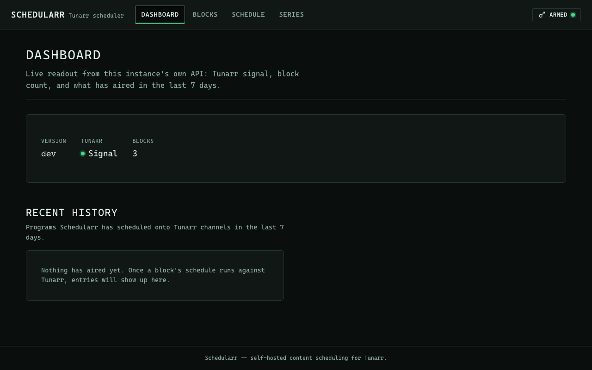
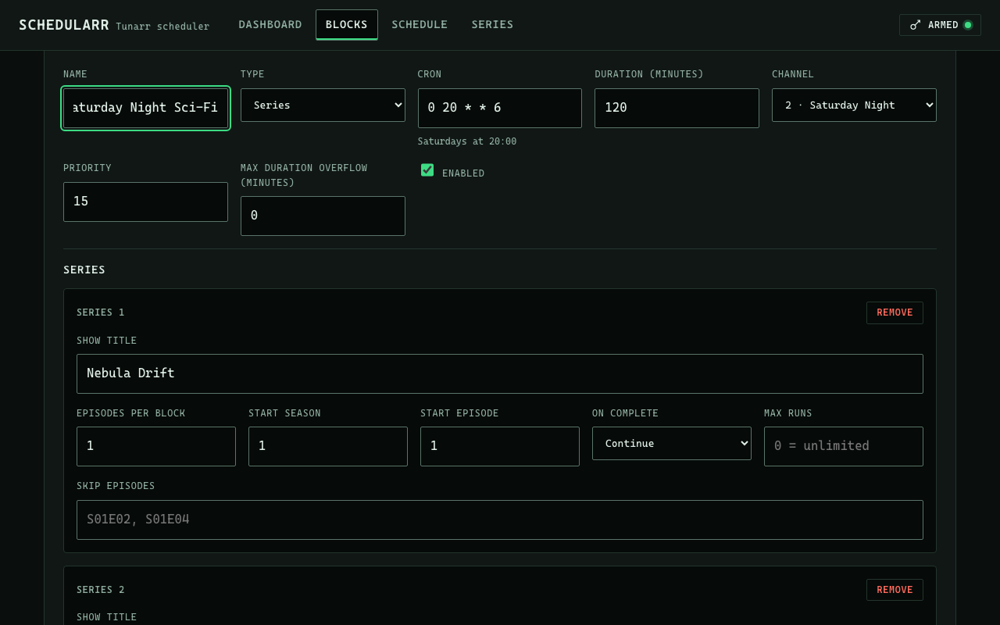
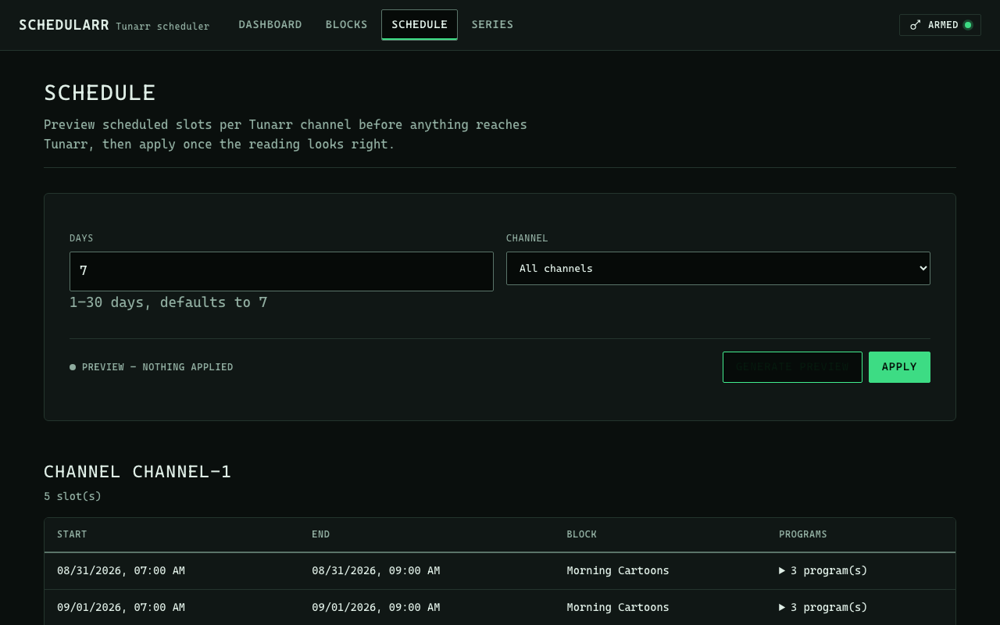
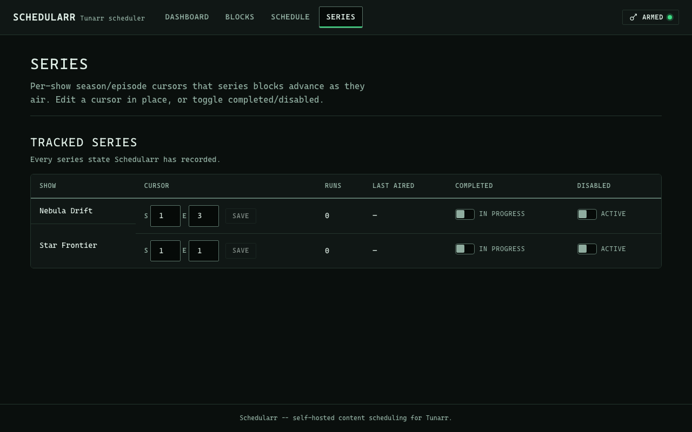

# Web UI Guide

A Hugo-built web UI lives in `web/` and is embedded into the `schedularr` binary via `go:embed` (`web/embed.go`, `package web`, `web.Site()`). `schedularr serve` mounts it as `internal/api.Config.UI` and serves it from the router's catch-all `NotFound` handler: the four system routes (`/healthz`, `/readyz`, `/metrics`, `/openapi.json`) and `/api/v1/*` win first, and everything else falls through to the embedded site.

A directory request resolves to that directory's `index.html` (`/` → `index.html`, `/blocks/` → `blocks/index.html`); the same request without its trailing slash (`/blocks`) gets a 301 redirect to the slash form, like `net/http.FileServer`. A path that matches no file serves `404.html` with HTTP 404. Non-GET/HEAD requests get a 405.

Every response the UI handler serves carries `X-Content-Type-Options: nosniff`, `Referrer-Policy: same-origin`, and a Content-Security-Policy where every directive is `'self'`/`'none'` (the site vendors Alpine.js, no CDN, and only calls its own origin's `/api/v1`). See [Design System](design-system.md) for the full CSP rationale and the design tokens behind the UI.

## Building the UI

Nothing under `web/public/` is tracked in git; `make web-presence` (a prerequisite of `make build`) writes a one-line placeholder there on demand when it's missing, so `go build ./...` keeps working without Hugo installed. A release build (the Docker image) always runs the real `hugo --minify -s web` first and never ships the placeholder.

Prerequisites to build the real UI locally:

- **[Hugo](https://gohugo.io/installation/)** ≥ 0.120 — `brew install hugo`
- **[Node.js](https://nodejs.org/)** with npm — only used to generate and type-check TypeScript; not required to build the Go binary

```bash
# One-time: install the npm devDependencies (typescript, openapi-typescript)
npm install --prefix web

# Regenerate TS types from api/openapi.yaml, type-check, then build with Hugo
make web
```

`make web-types` (openapi-typescript → `web/assets/ts/gen/types.d.ts`), `make web-check` (type-check with `tsc --noEmit`), and `make web-build` (the Hugo build) are real prerequisites of each other, in that order, so `make -j` can't interleave them.

## Token Setup

The UI talks to `/api/v1` with the same bearer token `schedularr serve` was started with (`SCHEDULARR_API_TOKEN` or `api.token` — see the [Deployment config reference](deployment.md#configuration-reference)). The token lives only in the browser's `localStorage` (key `schedularr_api_token`) and is attached to every API request; it is never embedded in the served HTML/JS.

1. Open the UI (`http://<host>:8484/` by default). With no token stored, the **Arm API Token** panel opens automatically.
2. Paste the same token the server was started with. The input is masked; click the eye icon to reveal it before saving.
3. **Save** persists it and closes the panel. **Clear** wipes it (and leaves the panel open). The panel is reachable anytime via the **Token** button in the header — the status dot next to it reflects whether a token is currently *stored*, not whether it's valid.
4. If any API call comes back `401` (wrong or expired token), the panel reopens automatically with an inline error. Saving a new token does **not** retry the action that failed — repeat it once the token is updated.

## Page Tour

### Dashboard (`/`)



*System status (version, Tunarr signal, block count) and recent history, each loaded independently.*

Two sections, each fetched independently on load:

- **System status** — reads `GET /api/v1/status`: the server `version`, a Tunarr signal indicator, and the current block count. A Tunarr that can't be reached renders as a normal instrument reading, not an error: the status dot flips to "No Signal" and the server's own `tunarr_error` text prints inline underneath it.
- **Recent history** — reads `GET /api/v1/history?days=7`: a table of what has aired (scheduled time in the browser's local timezone, plus channel, block, and program ID). An empty result renders an explanatory empty state rather than an empty table shell.

Both sections load, error, and empty-state independently: a failed `/status` call doesn't block history from rendering, and vice versa. A failure renders the API's `problem+json` `title`/`detail` inline, next to the section that failed, with a **Retry** button — never a toast.

### Blocks (`/blocks/`)



*The inline editor, open on a `series`-type block with two show rows.*

List every stored block and create/edit/delete them, backed entirely by `GET`/`POST`/`PUT`/`DELETE /api/v1/blocks[/{id}]`. One page, no routing between list and editor: a **+ New Block** button and each row's **Edit** open an inline panel above the list, which auto-scrolls into view and focuses the name field when it opens.

**List** — name, a type badge (`filter`/`series`), the raw cron plus a plain-language readback underneath it (**cronstrue** — see [Design System](design-system.md#vendored-dependencies)), `channel_id`, an **Enabled/Disabled** toggle, and **Edit**/**Delete**. Delete requires a second click ("Delete" → inline **Confirm**/**Cancel**) before anything is sent.

**Editor — common fields**: name, schedule (see "Schedule picker" below), duration (minutes), channel, priority, max duration overflow (minutes), and enabled. Name, schedule, duration, and channel are marked required with a static `*` next to the label. `channel_id` is a `<select>` populated from `GET /api/v1/channels` when Tunarr answers with at least one channel; it falls back to a free-text input (with an inline reason) when the call fails or returns nothing.

#### Schedule picker

A Simple/Cron mode toggle on the schedule field:

- **Simple mode** is a frequency select (daily / weekdays / weekly / monthly / custom days), day-of-week checkboxes (weekly/custom only), and a native `<input type="time">`, which together generate the 5-field cron string live as the operator adjusts them.
- **Cron mode** is the raw text field, with a permanent format caption (`min hour day-of-month month day-of-week (* = any)`) underneath it.

Switching from Cron to Simple mode parses the current cron string back into the picker's fields when the pattern is one Simple mode can represent (a plain fixed time, optionally restricted to specific weekdays or a single day-of-month); anything else — a day-of-month combined with a weekday restriction, a month restriction, a list/range/step on minute or hour — locks the field to Cron mode with an inline note rather than rendering a lossy guess.

A plain-language readback (**cronstrue**, vendored) renders live under the field in both modes, understanding any valid 5-field expression. Storage is unaffected either way: the cron string is still the one value submitted, whichever mode produced it.

#### Type-specific fields and autocomplete

`filter` shows genres/ratings/title-pattern(regex)/year range/duration range/tags (comma-separated inputs map to arrays; an empty input omits the field, it is never sent as `[]`). Genres and ratings are `<input list=...>` fields backed by a `<datalist>` populated from `GET /api/v1/media/meta`, fetched once per editor open; free text is always accepted regardless.

`series` shows repeating rows (show title, episodes per block, start season/episode, on-complete, skip-episodes, max runs — add/remove freely) plus a fallback section (redistribute/filler, with a nested filter subset when filler is chosen). Show title is the same `<input list=...>` pattern, backed by `GET /api/v1/media/shows`: an amber, non-blocking note ("Not found in Tunarr's library.") appears under a row whose typed title doesn't case-insensitively match any loaded show, as long as the media fetch itself succeeded — a failed fetch degrades silently to plain free text, with no datalist and no warning.

A **Filler** section (enabled, filler list ID, max filler time, min gap time) is available for either type. Every section maps 1:1 onto `BlockSpec` — the submitted JSON only ever contains fields the operator actually filled in, plus `type` and `enabled` (always explicit).

**Validation** — `skip_episodes` is checked client-side against `SxxExx` (e.g. `S01E05`) before submit, with the exact invalid token(s) named inline; everything else is left to the API. A `400` renders its `title`/`detail` inline near the submit button; a `409` (duplicate name) renders under the **name** field specifically.

### Schedule (`/schedule/`)



*A generated preview: chronological slots per channel, each with an expandable program list.*

Preview a schedule, then apply it — a dry-run/apply pair backed by `POST /api/v1/generate` and `POST /api/v1/apply`, the same `GenerateRequest` body (`days`, optional `channel_id`) as the CLI's `generate`/`generate --apply`. No timeline graphic: a chronological list per channel.

**Controls** — a `days` number input (1–30, defaulting to 7, clamped client-side to that range before every request) and a `channel_id` scope: a `<select>` (first option always **All channels**) populated from `GET /api/v1/channels`, falling back to free text (blank still means all channels) when Tunarr is unreachable.

**Preview** — **Generate Preview** sends `POST /api/v1/generate`, which always dry-runs. Each channel in the response renders as its own section: slots listed chronologically with **start**/**end** in the browser's local timezone, the block name, and a program count that expands (`<details>`) into the individual program titles. A visible **Preview — nothing applied** readout makes the dry-run state explicit.

**Apply** — disabled until a preview has run **for the exact controls currently on screen**: editing `days` or the channel scope after a preview invalidates it immediately, and a fresh **Generate Preview** is required to re-arm it (the web equivalent of the CLI's `--yes` gate, applied per action rather than once per process). Clicking **Apply** opens a native `<dialog>` confirmation naming the scope exactly: **"Apply ALL channels"** or **"Apply channel `<id>`"**, plus a real slot/channel count summary. Confirming sends `POST /api/v1/apply` with the identical body the preview used — `/apply` independently re-runs the generate-and-push workflow server-side, so this means the same request, not a cached payload. A successful apply flips the readout to **Applied** with a summary line and immediately disables **Apply** again.

### Series (`/series/`)



*Tracked series with inline season/episode cursor editing, run count, and status toggles.*

Every persisted `series_state` row — the per-show season/episode cursor a series block advances as it airs — backed by `GET`/`PATCH /api/v1/state/series[/{show_title}]`. There is no create endpoint: a row exists only once a series block airs that show for the first time, so an empty result renders an explanatory empty state.

**List** — show title, an inline SxxEyy cursor editor, run count, last aired (local time, or an em dash for a show that hasn't aired yet), and a **Completed**/**In Progress** toggle plus a **Disabled**/**Active** toggle.

**Cursor editing** — season and episode are two adjacent number inputs (`min="1"`) framed by `S`/`E` prefixes, independently editable inline in the same cell. **Save** stays disabled until the row is actually dirty and, on click, sends a true partial `PATCH`: only `current_season` and/or `current_episode` land in the body, and only when their parsed value actually differs from what was loaded. A season/episode value that isn't a whole number `>= 1` is rejected client-side with an inline message. Each toggle is its own single-field `PATCH` (`{"completed": true}` or `{"disabled": true}` alone).

**Row vanishes mid-edit** — a save against a `show_title` whose `series_state` row was deleted or reset out from under the operator returns `404`. The row stays on screen with an inline error and a **Refresh list** action next to the show title, rather than a row that silently can never save again.

## See also

- [Scheduling Concepts](scheduling-concepts.md) for what a filter/series block actually configures.
- [API Reference](api-reference.md) for every endpoint the UI calls.
- [Design System](design-system.md) for the visual system and vendored dependencies.
